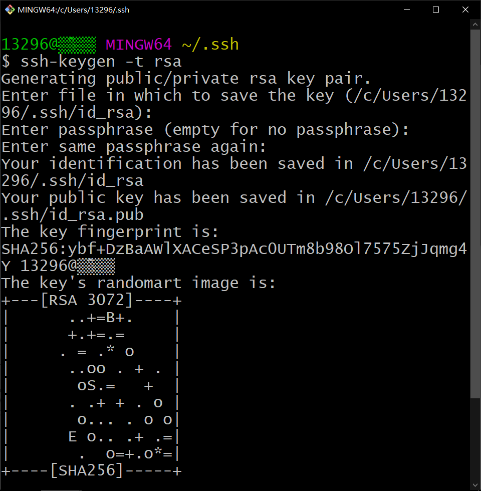
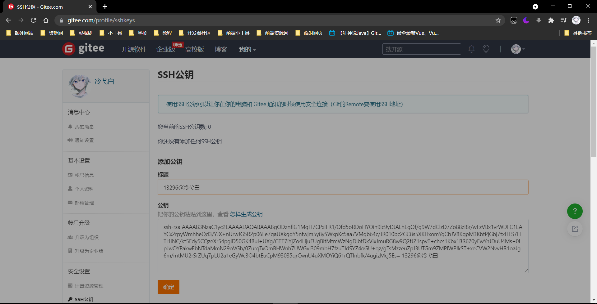

冷弋白

<a href='https://wpa.qq.com/msgrd?v=3&uin=1329670984&site=qq&menu=yes' style='text-decoration: none;
'>点击此处联系我</a>

# Git

## Linux指令

| 指令             | 描述                                                   |
| ---------------- | ------------------------------------------------------ |
| pwd              | 显示当前所在目录路径                                   |
| ls               | 列出当前目录所有文件及文件夹，加上`-a`即可查看隐藏文件 |
| cat 文件名       | 显示文件内容                                           |
| touch 文件名     | 新建文件                                               |
| rm 文件名        | 删除文件                                               |
| mkdir 文件夹名   | 新建文件夹                                             |
| rm -r 文件夹名   | 删除文件夹                                             |
| mv 文件名 文件夹 | 移动文件到文件夹                                       |
| clear            | 清屏                                                   |
| reset            | 初始化终端                                             |
| history          | 查看敲过的命令，即使退出过终端                         |
| #                | 注释                                                   |

## Git冷门指令

| 指令                                               | 描述               |
| -------------------------------------------------- | ------------------ |
| git config --global --list                         | 查看用户配置       |
| git config --system --list                         | 查看系统配置       |
| git config --global core.excludesfile ~/.gitignore | 配置全局.gitignore |

## 初始化操作

| 指令                                             | 描述                                   |
| ------------------------------------------------ | -------------------------------------- |
| git init                                         | 初始化项目                             |
| git config --global user.name lengyibai          | 首次使用必须设置用户名，否则提交会报错 |
| git config --global user.email 1329670984@qq.com | 首次使用必须设置邮箱，否则提交会报错   |

## 版本操作

| 指令                    | 描述                                           |
| ----------------------- | ---------------------------------------------- |
| git reflog              | 刷新日志信息                                   |
| git log                 | 查看详细版本信息（包含作者及邮箱及日期）       |
| git reset --hard        | 还原上一个版本的更改，加上版本号可回到指定版本 |
| git reset --soft HEAD~1 | 撤销上一次提交                                 |
| git commit --amend      | 去改上一次提交的日志信息                       |

## 分支操作

> 分支的作用：
>
> 主分支`mater`是用于发布新版本
>
> 其他分支用于多人开发及修复`bug`

| 指令                                                | 描述                                                     |
| --------------------------------------------------- | -------------------------------------------------------- |
| git branch                                          | 查看分支名，`-v`可直接查看详细信息，`-r`则是查看远程分支 |
| git branch 分支名                                   | 创建分支                                                 |
| git checkout 分支名                                 | 切换分支                                                 |
| git checkout -b 分支名                              | 新建并切换分支                                           |
| git merge 分支名                                    | 把指定分支合并到当前分支，如果内容不同会提示手动合并     |
| git branch -d 分支名                                | 删除分支                                                 |
| git push 远程别名 --delete 分支名                   | 同步删除远程分支                                         |
| git branch -m 分支名                                | 重命名当前分支                                           |
| git branch --set-upstream-to=远程别名/master master | 出现无法拉取需要指定本地`master`到远程的`master`         |

## 常用指令

| 指令                           | 描述                                                         |
| ------------------------------ | ------------------------------------------------------------ |
| git clone 仓库链接             | 克隆远程仓库到本地                                           |
| git add .                      | 添加进暂存区，追踪该文件                                     |
| git status                     | 查看本地库状态                                               |
| git commit -m ''消息内容'      | 提交到本地库                                                 |
| git rm -r --cached 文件名.后缀 | 删除暂存区的文件，案例：当直接`git add .`添加文件，如果不小心添加进不需要的文件或文件夹而影响上传速度，可以使用此指令删除此文件或文件夹 |

## 远程操作

| 指令                         | 描述                                                         |
| ---------------------------- | ------------------------------------------------------------ |
| git remote -v                | 查看当前所有远程地址别名                                     |
| git remote add 别名 远程地址 | 创建别名                                                     |
| git remote rm 别名           | 删除别名                                                     |
| git pull 远程库别名 分支名   | 拉取远程库，拉取前需要commit 如果提示有`Merge conflict in 文件名`，表示远程仓库文件被修改需要进行选择合并， 如果是类似`push`成功的提示，表示远程仓库比本地文件要新，并自动对本地进行了覆盖， 如果提示有`Already up to date.`，则可以push |
| git push 远程库别名 分支名   | 推送到远程库，加上`-f`表示强推                               |

## Git标签

> 用于记录一个大版本更新

| 指令                                | 描述                                                         |
| ----------------------------------- | ------------------------------------------------------------ |
| git tag                             | 查看标签                                                     |
| git tag -l v1.*                     | 查看`1.x.`的标签                                             |
| git show v1.1                       | 显示指定标签的详细信息                                       |
| git tag -a v1.0                     | 推送前将当前版本打上标签                                     |
| git tag -a v1.0 版本号              | 将指定版本打上标签                                           |
| git tag -a v1.0 -m '描述' 版本号    | 带描述                                                       |
| git tag -d v1.4                     | 如果标签打错了，可以删除标签重打                             |
| git push 远程别名 :refs/tags/标签名 | 删除远程标签，需要先删除本地                                 |
| git push 远程别名 --tags            | 将所有标签推送到远程 将`--tags`改成标签名可推送指定标签 |

## 忽略文件

|      | 例子       | 描述                                                         |
| ---- | ---------- | ------------------------------------------------------------ |
| *    | *.txt      | 忽略所有以.txt结尾的文件                                     |
| !    | !lib.txt   | 但`lib.txt`除外                                              |
|      | /temp      | 仅仅忽略根目录下的`temp文件夹`                               |
|      | build/     | 忽略build/目录下的所有文件                                   |
|      | /doc/*.txt | 忽略doc目录下以.txt结尾的文件，doc目录下的其他文件夹内不会忽略 |

## ssh公钥免密登录

> `ssh-keygen -t rsa`
>
> 然后一路回车

> 生成路径`C:\Users\13296\.ssh`
>
> 将`id_rsa.pub`内的内容粘贴到gitee的ssh公钥里

