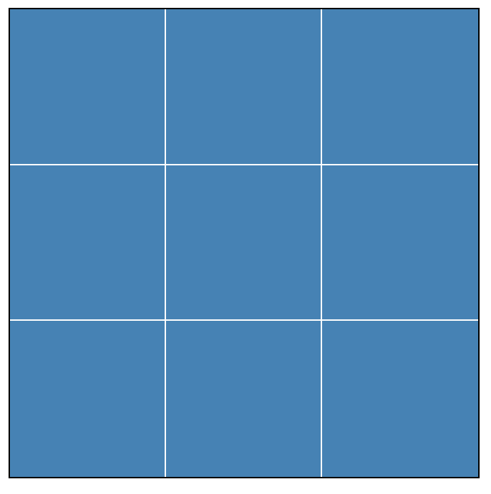
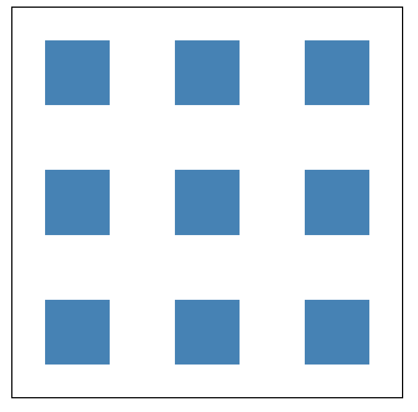

# HTML

## 视口标签

| 属性          | 描述                                                              |
| ------------- | ----------------------------------------------------------------- |
| width         | 设置视口宽度，可以设置为 device-width 设备宽度，标准 device-width |
| initial-scale | 初始缩放比，必须大于 0，标准 1.0                                  |
| maximum-scale | 最大缩放比，必须大于 0，标准 1.0                                  |
| minimum-scale | 最小缩放比，必须大于 0，标准 1.0                                  |
| user-scalable | 用户是否可以缩放，yes 或 no(1 或 0)，标准 0                       |

## 锚点定位

> 在指定标题标签里面添加`id="名字";`然后在超链接标签里面添加`href="#名字";`点击超链接即可跳指定位置

## 常用特殊符号

> 写完后必须加`;`

| 符号   | 字符    |
| ------ | ------- |
| 空格符 | &nbsp;  |
| ＞     | &gt     |
| ＜     | &lt     |
| &      | &amp    |
| ￥     | &yen    |
| ©      | &copy   |
| ®      | &reg    |
| °      | &deg    |
| ±      | &plusmn |
| ×      | &times  |
| ÷      | &divide |
| ²      | &sup2   |
| ³      | &sup    |

## 表单

### label 标签

> `label`的 for 绑定`input`的`id`能够点击`label`内的文字也能使`input`获取焦点
>
> 如果文字和`input`都存在于`label`，也能点击文字获取焦点

```html
<label for="male">男</label> <input type="radio" name="sex" id="male" />
```

### input 样式绑定

> `label`标签`for`绑定复选框`id`，`label`可控制复选框状态并自定义样式

```html
<label for="a"></label>
<input type="checkbox" id="a" />
```

| 属性 | 说明                                                                                                             |
| ---- | ---------------------------------------------------------------------------------------------------------------- |
| for  | 于绑定 input 里面的 id，可用于上面那个用法，前提是文字在 label 里，而 input 脱离了 label，点击文字就会触发 input |

### textarea 标签

> 输入大量的文字，用于评论，留言等

| 属性 | 说明         |
| ---- | ------------ |
| cols | 规定可见宽度 |
| rows | 规定可见行数 |

### select 标签

| 属性     | 说明       |
| -------- | ---------- |
| multiple | 多选，无值 |

#### 子标签 option

| 属性     | 说明       |
| -------- | ---------- |
| selected | 预选，无值 |

```html
可设置默认显示
<option disabled="disabled" value>请选择</option>
```

### form 标签

> 表单域，包住所有的表单，用于提交到服务器

| 属性    | 说明                                                                         |
| ------- | ---------------------------------------------------------------------------- |
| action  | 用于将数据提交到服务器，内容为服务器的 url 地址                              |
| method  | 提交方式                                                                     |
| name    | 规定表单名称                                                                 |
| enctype | 在发送到服务器之前应该如何对表单数据进行编码，multipart/form-data 为上传文件 |

# HTML5

## 语义化标签

| 标签    | 说明       |
| ------- | ---------- |
| header  | 头部标签   |
| nav     | 导航标签   |
| article | 内容标签   |
| section | 块级标签   |
| aside   | 侧边栏标签 |
| footer  | 尾部标签   |

## 多媒体标签

### 音频标签

```html
<audio>
  <source src="音频.ogg" type="audio/ogg" />
  <source src="音频.mp3" type="audio/mpeg" />
  您的浏览器版本太低，不支持此格式播放
</audio>
```

### 视频标签

```html
<video>
  <source src="视频.ogg" type="video/ogg" />
  <source src="视频.mp4" type="video/mp4" />
  您的浏览器版本太低，不支持此格式播放
</video>
```

### 属性

| 属性     | 说明                                                               |
| -------- | ------------------------------------------------------------------ |
| autoplay | 值 autoplay，自动播放                                              |
| controls | 值 controls，显示播放控件                                          |
| loop     | 值 loop，循环播放                                                  |
| src      | 文件路径                                                           |
| poster   | 如果不自动播放，则使用此属性添加视频封面路径                       |
| muted    | 值 muted，静音播放，添加此属性能解决谷歌浏览器不自动播放视频的问题 |

## 表单

| 属性          | 说明                        |
| ------------- | --------------------------- |
| type="url"    | 限制用户输入必须为 URL 类型 |
| type="date"   | 限制用户输入必须为日期类型  |
| type="time"   | 限制用户输入必须为时间类型  |
| type="month"  | 限制用户输入必须为月类型    |
| type="week"   | 限制用户输入必须为周类型    |
| type="number" | 限制用户输入必须为数字类型  |
| type="image"  | 图片提交按钮                |
| type="color"  | 生成一个颜色选择表单        |
| type="tel"    | 限制用户输入手机号类型      |

| 属性         | 说明                                                                                               |
| ------------ | :------------------------------------------------------------------------------------------------- |
| required     | 值即本身，提示用户表单不能为空                                                                     |
| autofocus    | 值即本身，页面加载完，自动聚焦指定表单                                                             |
| autocomplete | 值 off/on，输入内容提交后，会记入历史输入，下次输入会显示历史输入，前提需要有 name 属性，默认为 on |
| multiple     | 值即本身，用于多选文件上传                                                                         |
| min          | 最大值                                                                                             |
| max          | 最小值                                                                                             |
| accept       | 示例`accept=".png, .jpg"`，可让用户选择图片，但还是可以切换选择所有文件，验证就让`js`去做          |

# CSS

## 普通选择器

| 选择器 | 描述                                                         |
| ------ | ------------------------------------------------------------ |
| h1 + p | 兄弟选择器，选择`h1`紧挨着的下面的一个`p`元素，如果相隔一个元素将失效，常用于加边框 |
| h1 ~ p | 同层全体组合选择器，选择所有跟在`h1`后的同层`p`元素，不管它们之间隔了多少其他元素 |

## 属性选择器

> 如`div[class='lyb']`：匹配所有`class='lyb'`的 div 标签
>
> PS：`E[att="val"][att="vals"]`可连写，用于同时修改有`att="val"`的元素和有`att="vals"`属性的元素

| E 元素/att 属性/val 值 | 说明                                    |
| ---------------------- | --------------------------------------- |
| \*[att]                | 选择有 att 属性的所有元素               |
| E[att]                 | 选择有 att 属性的 E 元素                |
| E[att="val"]           | 选择有 att 属性且属性值=val 的 E 元素   |
| E[att^="val"]          | 匹配有 att 属性且值以 val 开头的 E 元素 |
| E[att$="val"]          | 匹配有 att 属性且值以 val 结尾的 E 元素 |
| E[att*="val"]          | 匹配有 att 属性且值含有 val 的 E 元素   |

## 结构伪类选择器

> 注：`n`可以是关键词：`even`偶数，`odd`奇数，可用于表格隔行变色；`n`可以是公式，`n`是从`0`开始依次加`1`的，如`2n`，则是偶数 2.4.6.8，`2n+1`则是奇数 1.3.5.7，`-n+m`则是选择前`m`个，`nth-last-child(-n+m)`则是选择后`m`个

| 匹配                                 | 说明                                                         |
| ------------------------------------ | ------------------------------------------------------------ |
| E:nth-child(n)                       | 匹配`E`标签或类名的第`n`个元素，非`E`将占用空间，且非`E`将无法匹配并修改样式 |
| E:not(:first-child)<br />E:not(.lyb) | 匹配除括号内的元素<br />注意匹配除`p`标签的`color`继承特性   |
| E:empty                              | 选择没有任何内容的元素，不包含有空格、换行符、注释、甚至已经定义了样式和伪元素 |
| :is(E1,E2,E3)                        | 批量同一样式<br />`:is(E1,E2,E3) a:hover` =`E1`、`E2`、`E3`的`a`鼠标悬浮<br />`:is(ol, ul) :is(ol, ul, menu, dir) :is(ul, menu, dir)`=`ol、ul`下面的`ol, ul, menu, dir`下面的`ul, menu, dir`标签<br />不支持伪元素<br />如果有一个优先级很高，则会带动其他优先级低的 |
| :where(E1,E2,E3)                     | 与`:is()`有同样的功能，但使用`where`设置的样式，权重为`0`，在任何地方都能被覆盖样式 |
| E:has(.box)                          | 匹配带有`.box`的`E`元素，但`Chrome`并不支持该属性            |
| E:focus                              | 输入框获取焦点后的样式                                       |

> 如果父盒子内有其他不相关的元素，建议使用以下

| 匹配             | 说明                                                         |
| ---------------- | ------------------------------------------------------------ |
| E:first-of-type  | 匹配所有E标签，如果E是类名，则匹配类名的标签名，然后获取     |
| E:last-of-type   | 最后一个                                                     |
| E:nth-of-type(n) | 匹配第`n`个`E`标签，如果`E`是类名，则匹配第`n`个同类同标签的元素<br />注：如果存在同类不同标签，会匹配第`n`个最后一种类别的标签，它对类名不太友好，是因为它只能用来选择同类型元素中的第`n`个元素，而不能用来选择同类名元素中的第`n`个元素 |

## 伪元素设置动态content

> 通过arr获取自定义属性值

```html
<style>
  .lyb::after {
    content: attr(data-name);
  }
</style>
<body>
  <div class="lyb" data-name="loading"></div>
</body>
<script>
  const el = document.querSelector('.lyb')
	el.dataset.percent = '冷弋白';
</script>
```

## 行内元素

| 标签   | 说明           |
| :----- | -------------- |
| a      | 定义超链接文本 |
| strong | 强调粗体文本   |
| b      | 定义粗体文本   |
| em     | 强调斜体文本   |
| i      | 定义斜体文本   |
| del    | 定义划掉文本   |
| ins    | 定义下划线文本 |
| u      | 定义下划线文本 |
| sub    | 定义下对齐     |
| sup    | 定义上对齐     |
| pre    | 保留空格和换行 |

## background

> 简写：背景色 背景图路径 背景平铺 背景位置 背景附着

### background-size

> 可填写像素、百分比，如果只填写一个，将默认等比拉伸宽度

| 属性值  | 说明                             |
| ------- | -------------------------------- |
| cover   | 等比拉伸铺满盒子                 |
| contain | 等比拉伸铺满高度或宽度将不再拉伸 |

### background-attachment

| 属性值 | 说明                     |
| ------ | ------------------------ |
| fixed  | 背景图片固定             |
| scroll | 背景图片随网页滚动而滚动 |

### background-position

> 底部对齐，向上移动`50px`，靠右对齐，向左移动`100px`

```css
background-position: bottom 50px right 100px;
```

## 宽高相等

```css
.lyb {
  width: 25vw;
  padding: 25vw 0 0;
}
```

## CSS样式表

### 获取样式表

```js
document.styleSheets; //css文件数组
document.styleSheets[0].rules; //css样式表，包含@Keyframe等
//可通过类型过滤出动画组
[...document.styleSheets[0].rules].filter(item => {
  return item instanceof CSSKeyframesRule;
})
```

### 插入样式表

```js
document.styleSheets[0].insertRule(
  `
  @keyframes rotate {
    0% {
      transform: rotate(180deg);
    }
    100% {
      transform: rotate(360deg);
    }
  }
  `,
  1 //代表插入索引位置，一般直接 document.styleSheets[0].cssRules.length
);

document.querySelector('.lyb').style.animation = 'rotate 1s linear infinite'; //可直接使用
```

# CSS3

## 粘性定位

> 用于 tab 栏当滚动到浏览器页面顶端，将会固定
>
> 替代了通过滚动事件来设置
>
> 需要给该元素添加`top: 0`

```css
.tab-control {
  position: sticky;
  top: 0px;
}
```

## 过渡动画

> `transition`: 属性名称 时间 时间曲线 何时开始

| 属性                       | 描述     |
| :------------------------- | :------- |
| transition-property        | 名称     |
| transition-duration        | 时间     |
| transition-timing-function | 时间曲线 |
| transition-delay           | 何时开始 |

## 动画

> `animation`：名称 时间 速度曲线 何时开始 播放次数 是否倒放 是否保持最终位置
>
> PS：可设置多个动画的效果，用逗号隔开，如`animation：a 1s, b 1s;`

| 属性值                    | 说明                                                              |
| ------------------------- | ----------------------------------------------------------------- |
| animation-name            | 名称                                                              |
| animation-duration        | 周期时间                                                          |
| animation-timing-function | 速度曲线                                                          |
| animation-delay           | 何时开始                                                          |
| animation-iteration-count | 次数，`infinite`无限循环                                          |
| animation-direction       | 动画是否倒放，默认`normal`，`alternate`倒放                       |
| animation-play-state      | 动画暂停，默认是`running`，还有`paused，`用于鼠标来触发           |
| animation-fill-mode       | 动画结束后状态，保持最后位置`forwards`，默认为回到起始`backwards` |

## 3D

| 属性               | 说明                                                         |
| ------------------ | ------------------------------------------------------------ |
| perspective-origin | 透视观察位置，默认`center`，填入`x`轴和`y`轴，单位可为像素及百分比，填一个值为`x`轴 |

## 倒影

> `-webkit-box-reflect: below -10px linear-gradient(transparent, transparent 0%, rgba(0, 0, 0, 0.25));`

| 属性值   | 说明                                                                                                                                  |
| :------- | ------------------------------------------------------------------------------------------------------------------------------------- |
| 倒影位置 | `above`：指定倒影在对象的上边<br />`below`：指定倒影在对象的下边<br />`left`：指定倒影在对象的左边<br />`right`：指定倒影在对象的右边 |
| 倒影距离 | 像素，可使用百分比                                                                                                                    |
| 遮罩层   | 一般为上面的线性渐变                                                                                                                  |

## 滤镜

> `backdrop-filter`只对下一层的元素生效，如`blur`毛玻璃

| 属性值          | 说明                             |
| --------------- | -------------------------------- |
| blur(px)        | 模糊度                           |
| brightness(%)   | 亮度                             |
| contrast(%)     | 对比度                           |
| drop-shadow     | 与普通阴影不同的是它不会忽略透明 |
| grayscale(%)    | 灰度图像                         |
| hue-rotate(deg) | 色相旋转选择                     |
| invert(%)       | 颜色反转                         |
| saturate(%)     | 饱和度                           |
| sepia(%)        | 褐色                             |

## 混合模式

> `mix-blend-mode`：（常用的一般是`soft-light`，`overlay`）
>
> 给文字设置`difference`可根据背景色改变颜色

| 混合方式    | 说明     |
| ----------- | -------- |
| normal      | 正常     |
| multiply    | 正片叠底 |
| screen      | 滤色     |
| overlay     | 叠加     |
| darken      | 变暗     |
| lighten     | 变亮     |
| color-dodge | 颜色减淡 |
| color-burn  | 颜色加深 |
| hard-light  | 强光     |
| soft-light  | 柔光     |
| difference  | 差值     |
| exclusion   | 排除     |
| hue         | 色相     |
| saturation  | 饱和度   |
| color       | 颜色     |
| luminosity  | 亮度     |

# CSS 变量

## 变量存放

### 全局

```CSS
:root{
    --lyb:pink;
}
div{
    color:var(--lyb);
}
```

### 局部

```css
div {
  --lyb: 10px;
  width: calc(var(--lyb) * 10);
  height: calc(var(--lyb) * 20);
}
```

## 修改变量

```js
let root = document.querySelector(":root");
root.style.setProperty("--lyb", "100px");
```

## 运用在动画

```html
<style>
  div {
    animation-delay: calc(0.46s * var(--a));
  }
</style>
<body>
  <div style="--a:1"></div>
  <div style="--a:2"></div>
  <div style="--a:3"></div>
  <div style="--a:4"></div>
  <div style="--a:5"></div>
</body>
```

## calc函数

> 子盒子永远比父盒子小 100px：`width:calc(100% - 100px);`

## clamp函数

> 设置最大、最小区间

```css
.test {
  /* 最小50px 当前10vw 最大250px */
  font-size: clamp(50px, 10vw, 250px);
}
```

# CSS 技术

## 精灵图

> 释义：一张宽 24px，高 72px 的精灵图，里面的图标都是 24×24 的，-48px 表示从精灵图 48px 的位置开始，选取下面 24px 高的图标，所以整张整张精灵图有 48+24=72px 高

```css
a,
b,
c {
  width: 24px;
  height: 24px;
  background: url() no-repeat;
}
a {
  background-position: 0 0;
}
b {
  background-position: 0 -24px;
}
c {
  background-position: 0 -48px;
}
```

> 使用 JS 快速生成

```js
let lis = document.querySelectorAll("li");
for (let i = 0; i < lis.length; i++) {
  let index = i * 44;
  lis[i].style.backgroundPosition = "0 -" + index + "px";
}
```

## 制作三角形

```css
div {
  width: 100px;
  height: 100px;
  border-style: solid;
  border-width: 50px;
  box-sizing: border-box;
  border-color: red yellow green blue;
}
```

<div style="width: 200px;
    height: 200px;
    border-style: solid;
    border-width: 100px;
    box-sizing: border-box;
    border-color: red yellow green blue;">
</div>

## 网页图标

```html
<head>
  <link rel="shortcut icon" href="favicon.ico" type="image/x-icon" />
  <!--  转为ico格式：www.bitbug.net -->
</head>
```

## 合并盒子边框线

> 如果想做好几个盒子边框线，但又想让它们的边框线合并，看着没那么厚，则可以使用`margin-left:-(border的厚度)`
>
> 当有两行盒子，让它们上下边框合并则使用`margin-top:-(border的厚度)`
>
> 但想给它们加 hover 悬浮盒子后改变边框颜色，却会被右边的盒子压住右边框线，则只需要在盒子里面加入`z-index`层级就行了

# CSS 额外笔记

## 文本相关整合

| 属性名                         | 说明                                                        |
| ------------------------------ | ----------------------------------------------------------- |
| text-indent                    | 首行缩进，2em 表示两个汉字的距离                            |
| letter-spacing                 | 字符间距，px 为单位                                         |
| word-spacing                   | 单词间距                                                    |
| word-break:break-all           | 文字换行                                                    |
| white-space: nowrap            | 文字不换行，直到遇到 `<br/>`标为止                          |
| writing-mode: vertical-lr      | 文字从上到下从左到右排列                                    |
| -webkit-text-stroke: 宽度 颜色 | 文字描边                                                    |
| user-select: none              | 禁止选中文字                                                |
| touch-action: none             | 禁止移动端滑动屏幕及放大缩小一切操作                        |
| line-height: 1                 | 文字自带行高影响布局，设为 1 可清除默认行高，2 则相距一个字 |

## 大小写转换

**text-transform**

| 属性值     | 说明               |
| ---------- | ------------------ |
| none       | 还原               |
| uppercase  | 所有字母转为大写   |
| lowercase  | 所有字母转为小写   |
| capitalize | 每个单词首字母大写 |

## CSS 点击

**first:target**

> 只能使用超链接点击，链接设置为盒子的#first，给需要改变的盒子添加`id="first"`

```html
<style>
  #lyb {
    width: 300px;
    height: 300px;
    background: #ccc;
  }
  #lyb:target {
    background-color: red;
  }
</style>
<body>
  <a href="#lyb">点我</a>
  <div id="lyb"></div>
</body>
```

## 冷门样式修改

### 输入框描述

```css
input::-webkit-input-placeholder {
  color: #ccc;
  font-size: 12px;
}
```

### 输入框光标颜色

```css
input {
  caret-color: red;
}
```

###  删除 `type="number"` 末尾的箭头

```css
.no-arrow::-webkit-outer-spin-button,
.no-arrow::-webkit-inner-spin-button {
  -webkit-appearance: none;
}
```

# 其他整合

| 属性名                                      | 说明                                                         |
| ------------------------------------------- | ------------------------------------------------------------ |
| @dragstart.prevent                          | Vue阻止拖拽                                                  |
| tap-highlight-color: transparent            | 解决移动端点击出现蓝色背景                                   |
| pointer-events: none                        | 鼠标穿透，auto 还原                                          |
| flex-shrink: 0;                             | 解决开启 flex 后，子盒子正常宽度无法撑开盒子的问题           |
| resize: both;                               | 使用此属性需要加overflow: hidden                             |
| scroll-behavior: smooth;                    | 平滑滚动                                                     |
| overscroll-behavior: contain;               | 阻止在子盒子内滚动到底部后继续滚动会带动父盒子滚动           |
| overflow-anchor:auto;                       | 解决当滚动到一定位置，上面的图片加载完成了，会直接把当前位置的内容给推下去 |
| scroll-snap-type: y proximity \| mandatory; | 滚动贴合，需要设置宽高以及`overflow: auto`，给子元素设置：`     style="scroll-snap-align: start"` |

# 布局

## 媒体查询

> 需要写在被修改样式的下面，否则将会因为权重问题而无法修改，如果加`!important`又显得比较多余

```html
<!DOCTYPE html>
<html lang="en">
  <head>
    <meta charset="UTF-8" />
    <meta
      name="viewport"
      content="width=device-width, initial-scale=1.0, maximum-scale=1.0, user-scalable=0"
    />
    <meta http-equiv="X-UA-Compatible" content="ie=edge" />
    <title>冷弋白的网页</title>
    <style>
      * {
        margin: 0;
        padding: 0;
        transition: all 0.25s ease-out;
      }

      .container {
        height: 150px;
        background-color: pink;
        margin: 0 auto;
      }

      @media screen and (max-width: 1440px) {
      }

      @media screen and (max-width: 1024px) {
      }

      @media screen and (max-width: 768px) {
      }

      @media screen and (max-width: 425px) {
      }
    </style>
  </head>

  <body>
    <!-- JS -->
    <script></script>
  </body>
</html>
```

## grid 布局

### 父盒子属性

| 属性                            | 值                                                           | 解释                                                         |
| ------------------------------- | ------------------------------------------------------------ | ------------------------------------------------------------ |
| ①grid-template-columns          | 值 1：100px 100px 100px<br />值 2：repeat(3,100px)<br />值 3：repeat(auto-fill,100px)<br />值 4：1fr 2fr 3fr<br />值 5：repeat(4,1fr)<br />值 6：1fr minmax(150px，1fr)<br />值 7：100px auto 100px | 值 1&2：三列，每列 100px<br />值 3：列数随着父盒子宽度改变而改变<br />值 4：三列，宽度分配比例 1:2:3<br />值 5：四列，宽度等比分配<br />值 6：第一列宽度自动分配，第二列最小 150px，最大 1fr<br />值 7：左右 100px，中间自动分配，1fr 有同样的效果 |
| ②grid-template-rows             |                                                              | 与①一样，但是纵向                                            |
| ~~③column-gap~~                 | ~~-~~                                                        | ~~每列格子之间的间距~~                                       |
| ~~④row-gap~~                    | ~~-~~                                                        | ~~每行格子之间的间距~~                                       |
| ⑤gap (3 和 4 的简写)            | -                                                            | -                                                            |
| ⑦grid-auto-flow                 | 值 1：row dense                                              | 与flex-direction相当<br />值 1：换行时如果有空的地方，下面的盒子会填充上来 |
| ⑧justify-items                  | start \| end \| center                                       | 子盒子水平排列方式，需要子盒子小于 grid 格子宽高才会生效     |
| ⑨align-items                    | start \| end \| center                                       | 子盒子垂直排列方式，需要子盒子小于 grid 格子宽高才会生效     |
| ⑩place-items(8 和 9 的简写)     | -                                                            | -                                                            |
| ⑪justify-content                | 和 flex 布局一样                                             | 所有子盒子整体水平布局                                       |
| ⑫align-content                  | 和 flex 布局一样                                             | 所有子盒子整体垂直布局                                       |
| ⑬place-content(11 和 12 的简写) | -                                                            | -                                                            |
| ⑭grid-auto-columns              | 不常用                                                       |                                                              |
| ⑮grid-auto-rows                 | 不常用                                                       |                                                              |

### 单个子盒子属性

| 属性                            | 值                     | 描述                           |
| ------------------------------- | ---------------------- | ------------------------------ |
| ①grid-column-start              | 1                      | 从横向第一个的左边那条线开始   |
| ②grid-column-end                | 3                      | 从横向第三条线结束，共占用两格 |
| ③grid-row-start                 | 1                      | 从纵向第一个的左边那条线开始   |
| ④grid-row-end                   | 3                      | 从纵向第三条线结束，共占用两格 |
| ⑤grid-column(1 和 2 的简写形式) | -                      | -                              |
| ⑥grid-row(3 和 4 的简写形式)    | -                      | -                              |
| ⑦grid-area                      | 1 / 1 / 3 / 3          | 以上四个的简写，占用 2×2 格    |
| ⑧justify-self                   | start \| end \| center | 跟 justify-items 用法一致      |
| ⑨align-self                     | start \| end \| center | 跟 align-items 用法一致        |
| ⑩place-self (8 和 9 的简写形式) | -                      | -                              |

## 简单教程

### grid-template-columns

> grid 自身就是一个类似 flex 的盒子
>
> `grid-template-columns: 50px 50px 50px;`
>
> `grid-template-rows: 50px 50px 50px;`
>
> 这两个属性将 grid 分成了 9\*9 的空间，每个空间 50px，空间也撑开了 grid

```html
<head>
  <style>
    * {
      margin: 0;
      padding: 0;
    }

    body {
      height: 100vh;
      display: flex;
      flex-flow: column wrap;
      justify-content: center;
      align-items: center;
      background-color: rgb(255, 255, 255);
    }

    .grid {
      display: grid;
      grid-template-columns: 50px 50px 50px;
      grid-template-rows: 50px 50px 50px;
      outline: 1px solid rgb(0, 0, 0);
    }
    /*
        .a {
            width: 100%;
            height: 100%;
            background-color: steelblue;
            outline: 1px solid rgb(255, 255, 255);
        }*/
  </style>
</head>

<body>
  <div class="grid">
    <!--
        <div class="a"></div>
        <div class="a"></div>
        <div class="a"></div>
        <div class="a"></div>
        <div class="a"></div>
        <div class="a"></div>
        <div class="a"></div>
        <div class="a"></div>
        <div class="a"></div> -->
  </div>
</body>
```


_这张图是浏览器开发者工具选中它所呈现的虚线和淡蓝色背景，实际上是空白_

> 当我们解开注释，类名为 a 的元素宽高由于是 100%，所以填满了空间


### 父盒子固定宽高

> 我们现在给 grid 盒子设置宽高为 300px，并将下列两个属性原来 50px 的值设置为 1fr
>
> 1fr 相当于是 flex 布局中，子项的 flex，它将自动分配空间来填充 grid
>
> `grid-template-columns：1fr 1fr 1fr;`
>
> `grid-template-rows：1fr 1fr 1fr;`



> 还是上面的设置，我们将类名为 a 的元素的宽高都设为 50px
>
> 事实上每个元素存在于每个 grid 格子内，每个元素的初始位置即左上角


### justify/align-items

> 我们再给 grid 加上
>
> `align-items: center;`
>
> `justify-items: center;`
>
> 里面的每个元素就水平垂直居中了，既然 items 是控制元素的，那还有一个 content 是控制主体的



> 现在我们再将 grid 和类名为 a 的元素的几个属性设置为如下
>
> grid 的
>
> `grid-template-columns: 50px 50px 50px;`
>
> `grid-template-rows: 50px 50px 50px;`
>
> `align-content: center;`
>
> `justify-content: center;`
>
> 类名为 a 的元素的
>
> `width: 100%;`
>
> `height: 100%;`
>
> 由于我们给 grid 设置了宽高，又将 grid-template-columns 和 grid-template-rows 的属性换成固定值，固定值总和小于父盒子宽高，此时那 9 个存放元素的空间就挤在了初始位置左上角，由此我们可以使用 align-content 和 justify-content 来控制这 9 个空间整体在 grid 的位置为水平垂直居中


> 我们可以设置 column-gap 和 row-gap 控制每个空间的间隔
>
> `row-gap: 10px;`
>
> `column-gap: 30px;`
>
> 也可以使用 gap
>
> `gap: 10px 30px;`


> 此时将 justify-content 和 align-content 的属性值修改成 space-between 能呈现另一种排列方式


### grid-template-areas

> 可以使用 grid-template-areas 来定义模板，如下

```html
<head>
  <style>
    * {
      margin: 0;
      padding: 0;
    }

    body {
      height: 100vh;
      display: flex;
      flex-flow: column wrap;
      justify-content: center;
      align-items: center;
    }

    .grid {
      width: 250px;
      display: grid;
      grid-gap: 7px;
      grid-template-areas:
        "h h h"
        "i j j"
        "k k k";
    }

    .a,
    .b,
    .c,
    .d {
      border-radius: 3px;
    }

    .a {
      height: 50px;
      background-color: #ea707a;
      grid-area: h;
    }

    .b {
      height: 200px;
      background-color: #fdc25b;
      grid-area: i;
    }

    .c {
      height: 200px;
      background-color: #69c9f9;
      grid-area: j;
    }

    .d {
      height: 50px;
      background-color: #6cd58b;
      grid-area: k;
    }
  </style>
</head>

<body>
  <div class="grid">
    <div class="a"></div>
    <div class="b"></div>
    <div class="c"></div>
    <div class="d"></div>
  </div>
</body>
```


# JavaScript

## 箭头函数

> 对象方法中，不适用箭头函数

```js
  const obj = {
    name: "张三",
    getName() {
      return this;
    },
    getName1: () => {
      return this;
    },
  };
  console.log(obj.getName()); //obj
  console.log(obj.getName()); //window
```

## 报错处理

> `try`：捕获`try`作用域里面的第一个异常
>
> `catch`：抛出`try`捕获的异常，`(err)`可省略

```js
try {
  alert(Welcome);
  adddlert("Welcome");
} catch (err) {
  console.err(err); //在控制台显示异常，但不会终止程序
}
alert("a");
```

### 手动抛出错误

```js
throw new Error("错误"); //会中断后面的操作
console.error("错误"); //仅仅打印错误
```

## 严格判断两个值是否相等

```js
Object.is(value1,value2)
```

## Number 相关

### Math 方法

| 用法                         | 说明                                                         |
| ---------------------------- | ------------------------------------------------------------ |
| MAX_VALUE                    | 获取无穷大的值                                               |
| Math.max('1', '3', '4', '2') | 最大值`4`                                                    |
| Math.min(1, 3, 4, 2)         | 最小值`1`                                                    |
| Math.abs(-10)                | 绝对值`10`                                                   |
| Math.floor(1.9)              | 往小的取`1`，`-1.9`即`-2`                                    |
| Math.ceil(1.1)               | 往大的取 `2`，`-1.9 `即`-1`                                  |
| Math.round(1.5)              | 四舍五入                                                     |
| Math.pow(2,10)               | `2`的`10`次方，可简写为 `2 ** 10 `                           |
| Math.trunc(3.5)              | 抹去小数部分`3`，相当于不做四舍五入，可简写为`~~3.5`，会将`true`转换为`1`，非数字转换为`0` |
| Math.sign()                  | 判断是正数还是负数还是` 0`，正数返回 `1`，负数返回`-1`，`0` 返回 `0` |
| Number.isInteger(n)          | 判断是否为小数，整数为`true`                                 |
| num.toFixed(n)               | 保留`n`位小数，会四舍五入，返回的是字符串                    |
| parseInt(num)                | 去掉小数点，不会四舍五入，建议只用于`16px`会被转成`16`       |
| Number(num)                  | 保留小数，性能优于上一个                                     |

## 代码优化

### 多个条件的判断

```js
//普通写法
if (x === "abc" || x === "def" || x === "ghi" || x === "jkl") {
}

//简写方法
if (["abc", "def", "ghi", "jkl"].includes(x)
```

### 一次渲染上万数据

> 通过本地节流渲染或分页渲染，减少白屏时间

```html
<template>
  <div class="Test">
    <li v-for="(item, index) in data" :key="index">
      {{ index + 1 }}
    </li>
  </div>
</template>
<script>
export default {
  name: "Test",
  data() {
    return {
      data: [],
      getData: [],
      total: 0,
      page: 0,
      limit: 100,
      totalPage: 0,
    };
  },
  components: {},
  mounted() {
    for (let i = 0; i < 1_0000; i++) {
      this.getData.push(i);
    }
    this.total = this.getData.length;
    this.totalPage = Math.floor(this.total / this.limit);
    this.fn();
  },
  methods: {
    fn() {
      const _this = this;
      function fn(page) {
        if (page <= _this.totalPage) {
          window.requestAnimationFrame(function () {
            _this.data.push(..._this.getData.splice(0, _this.limit));
            fn(_this.page + 1);
          });
        } else if (_this.getData.length) {
          _this.data.push(..._this.getData);
        }
      }
      fn(this.page);
    },
  },
};
</script>
<style scoped lang="less">
.Test {
  width: 100%;
  height: 100%;
}
</style>
```

## 字符串

### [字符串去重（set）](#set字符串去重)

### 大小写转换

```js
"abc".toUpperCase(); //ABC
"ABC".toLowerCase(); //abc
```

### concat 合并字符串

> 数组也可以使用：[concat 数组合并](#concat数组合并)
>
> 不会修改原字符串

```js
var str1 = "123";
var str2 = "456";
var str3 = "789";
console.log(str1 + str2); //原始方法
console.log(str1.concat(str2, str3));
```

### slice 截取范围字符

> 返回截取的字符串，括号相当于截取`[ )`
>
> 不会修改原字符串
>
> `slice(3)`：从下标 3 开始截取后面所有的字符
>
> 数组也可以使用`slice`：[数组截取](#slice数组截取)

```js
let str = "123456";
console.log(str.slice(1, 4)); //'234'
```

### substr 截取指定个数字符

> `substr(3, 2)`：从下标 3 开始截取，共截取 2 个字符
>
> 不会修改原字符串
>
> `substr(3)`：从下标 3 开始截取后面所有的字符
>
> 不会修改原字符串

```js
let str = "Hello World";
console.log(str.substr(6, 5)); //'World'
console.log(str.substr(9)); //'ld'
```

### charAt()返回指定位置字符

> 和`[]`相比，反而比较繁琐

```js
var str = "abcd";
console.log(str.charAt(2)); //c，和str[2]一样
```

### indexOf 查找字符/串

> 返回字符串中指定文本首次出现的索引，未找到返回-1
>
> 使用`lastIndexOf`倒着查找
>
> 与[search()](<#search()>)功能一样，但 search()可以使用正则表达式
>
> 数组也可以使用：[indexOf 查找元素](#indexOf查找元素)

```js
let str = "abcabc";
console.log(str.indexOf("a")); //0，返回当前索引号，它只返回第一个满足条件的索引号
console.log(str.indexOf("d")); //-1，如果找不到字符，则返回-1
console.log(str.indexOf("a", 1)); //3，从下标为1的位置开始查找
/* 倒着查找 */
console.log(str.lastIndexOf("a")); //3，返回最后一个a索引号
console.log(str.lastIndexOf("a", 2)); //0，从下标为2的位置开始查找
```

### includes 检测字符串

> 判断是否包含一个指定的值
>
> 有第二参数，从何处开始查找，如果是负数，则从数组长度+负数，倒着的位置查找
>
> 如果是返回`true`，否则`false`
>
> 数组也可以使用[includes 检测数组](#includes检测数组)

```js
let arr = "like";
console.log(arr.includes("i")); //true
console.log(arr.includes("b")); //false
```

### toString 转字符串

> 不会修改原字符串

```js
let a = 123;
console.log(a.toString());
console.log(String(a));
//隐式转换
let b = 123 + " ";
```

### replace 字符替换

> 返回替换后的字符串，且只能替换最后一个，但加 g 可全局匹配，如[正则替换](<#replace()>)
>
> 不会修改原字符串

```js
let str = "123321";
console.log(str.replace("3", "0")); //'120321'

/* 替换全部 */
console.log(str.replace(/3/g, "0")); //'120321'
//等价于
console.log(str.replaceAll("3", "0")); //'120021'
```

### split 字符串转数组

> 括号留空，可以直接转数组，可用于字符串替换
>
> 不会修改原字符串

```js
var str = "a.b.c.d";
console.log(str.split(".")); //["a", "b", "c", "d"]
```

### trim()自动清除空格

> 自动清除空格，换行符，可用于输入框
>
> 不会修改原字符串
>
> 手动选择删除位置：头部：`trimStart()`、尾部`trimEnd()`

```js
let a = "  123   ";
console.log(a.trim()); //123
```

### padStart/End 字符补充

> 不会修改原字符

```js
let h = "6",
  m = "6",
  s = "6";
console.log(
  h.padStart(2, "0") + ":" + m.padStart(2, "0") + ":" + s.padStart(2, "0")
);

let tel = "12345678910";
console.log(tel.slice(0, 6).padEnd(11, "*"));
```

### starts/endWith 判断开头结尾字符

```js
let str1 = "Hello world";
str.startsWith("Hello"); //true
str.endsWith("world"); //true
```

### 重复字符串

```js
"superman".repeat(2); ////supermansuperman
```

## 大小写转换

> 不会修改原字符串

```js
var str = "Ab123Cd";
console.log(str.toUpperCase()); //AB123CD
console.log(str.toLowerCase()); //ab123cd
```

### 字符串翻转

```js
function ReverseStr(str = "") {
  return str.split("").reduceRight((items, item) => items + item);
}

const str = "reduce最牛逼";
ReverseStr(str); // "逼牛最ecuder"
```

## 数组

### at()索引

> 替代传统`[]`来获取数组，支持负数倒着获取，从`-1`开始

```js
let arr = ['a','b','c'];
arr.at(0); //a
arr.at(-1); //c
```

### concat 数组合并

> 遗憾的是已被 ES6 的[利用扩展运算符数组合并](#数组合并)取代
>
> 字符串也可以使用：[concat 合并字符串](#concat合并字符串)

```js
let arr = [1, 2];
let arrs = [1, 2];
console.log(arr.concat(arrs)); //[1,2,1,2]
```

### toString 转字符串

> 转换后的字符串以逗号分隔，但可以简写为`arr+''`

```js
let arr = [1, 2, 3, 4];
console.log(arr.toString()); //1，2，3，4
```

### join 数组转字符串

> 可自定义分隔符
>
> 另外还有 ES6 的[利用扩展运算符字符串转数组](#字符串转数组)

```js
let arr = [1, 2];
console.log(arr.join(",")); //1,2 以逗号分割
```

### unshift 头部添加元素

> 返回添加的元素

```js
let arr = [2, 3];
console.log(arr.unshift(1)); //1
console.log(arr); //[1,2,3]
```

### push 尾部添加元素

> 返回添加的元素，原数组会被修改

```js
let arr = [1, 2];
console.log(arr.push(3, 4)); //3
```

### shift 删除头部元素

> 删除数组最后一个元素，返回删除的元素

```js
let arr = [1, 2, 3, 4, 5, 6];
console.log(arr.shift()); //1
console.log(arr); //[2, 3, 4, 5, 6]
```

### pop 删除尾部元素

> 返回删除的元素

```js
let arr = [1, 2, 3, 4, 5, 6];
console.log(arr.pop()); //6
console.log(arr); //[1, 2, 3, 4, 5]
```

### slice 数组截取/拷贝

> 返回截取的数组
>
> 不会修改原数组
>
> 字符串也可以使用 slice：[字符串截取](#slice截取字符串)

```js
let arr = [1, 2, 3, 4, 5];
console.log(arr.slice(2)); //3
console.log(arr.slice(1, 4)); //[2,3,4] 从下标1开始，截取到下标4
```

> 拷贝数组(深拷贝)
>
> 也可以使用[扩展运算符拷贝](#...数组拷贝)

```js
let arr = [1, 2, 3, 4, 5];
let arr1 = [];
arr1 = arr.slice();
```

### slice 获取数组最后 n 位

> 返回的是数组类型

```js
arr.slice(-n);
```

### splice 删除/添加范围元素

> 返回被删除的数组元素（数组形式），原数组会被修改
>
> `-n`可倒着删除

```js
//删除
let arr1 = [1, 2, 3, 4, 5, 6];
console.log(arr1.splice(2, 3)); //[3,4,5] 从第三个元素开始，共删除3个，
console.log(arr1); //[1,2,6]
console.log(arr1.splice(2)); //[2,3,4,5] 删除下标2后面的元素
console.log(arr1); //[1,2]
//添加
var arr2 = ["a", "b", "c"];
arr2.splice(2, 0, 1, 2); //添加到下标2，删除0个
console.log(arr2); //[ 'a', 'b', 1, 2, 'c' ]
```

### reverse 数组翻转

> 返回翻转后的数组，原数组会被修改

```js
let arr = [1, 2];
console.log(arr.reverse()); //[2,1]
console.log(arr); //[2,1]
```

### sort 数组排序

> 原数组会被修改
>
> PS：参数`a`为数组第二位，`b`为数组第一位，所以交换参数区分
>
> 如果返回为负数，则`a`和`b`交换位置

```js
let arr = [9, 5, 7, 3, 1];
arr.sort((a, b) => {
  return a - b; //如果想倒序，则b - a;
});
console.log(arr); //[1, 3, 5, 7, 9]

//乱序
var arr = ["A", "B", "C", "D"];
arr.sort(() => 0.5 - Math.random())

console.log(arr);
```

### for...of 遍历数组

```js
/*a b c d*/
let arr = [
  ["a", "A"],
  ["b", "B"],
  ["c", "C"],
];
for ([k, v] of arr) {
  console.log(k, v);
}
//a A
//b B
//c C
```

### for await of 异步遍历数组

```js
function TimeOut(time) {
  return new Promise((resolve) => {
    setTimeout(function () {
      resolve(time);
    }, time);
  });
}
async function test() {
  let arr = [TimeOut(1000), TimeOut(2000), TimeOut(3000)];
  for await (let item of arr) {
    console.log(item);
  }
}
test();
```

### forEach 遍历数组

```js
let arr = [1, 2, 3];
arr.forEach((value, index, array) => {
  //如果只填一个值，则是value
  console.log("数组元素：" + value);
  console.log("索引号：" + index);
  console.log("数组：" + array);
});
/*
数组元素：1
索引号：0
数组：1,2,3
数组元素：2
索引号：1
数组：1,2,3
数组元素：3
索引号：2
数组：1,2,3
 */
```

### map 遍历数组

> `map`方法可以先遍历，再整合返回遍历后的数组
>
> 不能用于筛选数组，适用于计算

```js
let arr1 = [1, 2, 3];

let arr2 = arr1.map((el) => {
  return el * 2;
});

console.log(arr2); //[2, 4, 6]
```

### filter 筛选数组

> 返回符合条件的数组元素（数组形式），且不会修改原数组
>
> `filter`和`forEach`一样有相同的三个参数
>
> 具有 map 的特性：可以先遍历，再整合返回遍历后的数组

```js
let arr = [
  { id: 1, name: "奔驰" },
  { id: 2, name: "宝马" },
  { id: 3, name: "大众" },
  { id: 4, name: "奥迪" },
  { id: 5, name: "奔驰" },
];
function search(value) {
  return arr.filter((el) => el.name.indexOf(value) != -1);
}
console.log(search("奔"));
```

#### 嵌套搜索

> 返回数组内的数组内符合条件的数组

```js
function fn(arr, key, value) {
  let search_arr = arr.filter(item => {
    return item[key[0]].find(item => {
      return item[key[1]].indexOf(value) !== -1;
    });
  });
  search_arr.forEach(item => {
    item[key[0]] = item[key[0]].filter(item => {
      return item[key[1]].indexOf(value) !== -1;
    });
  });
  return value ? search_arr : arr;
}

const arr = [
  {
    male: '男',
    list: [{ name: '张三' }, { name: '李四' }],
  },
  {
    male: '女',
    list: [{ name: '王五' }, { name: '赵六' }],
  },
];

console.log(JSON.parse(JSON.stringify(fn(arr, ['list', 'name'], '张三'))));
/* [
  {
    "male": "男",
    "list": [
      {
        "name": "张三"
      }
    ]
  }
] */
```

### findIndex 查找元素

> 返回第一个符合条件的数组成员的下标
>
> 如果所有成员都不符合条件，则返回-1
>
> 节省性能

```js
let arr1 = [1, 2, 3, 4];
let arr2 = arr1.findIndex((value) => {
  return value > 3;
});
console.log(arr2); // 3
```

### includes 检测数组

> 判断是否包含一个指定的值
>
> 有第二参数，从何处开始查找，如果是负数，则从数组长度+负数，倒着的位置查找
>
> 如果是返回`true`，否则`false`
>
> 字符串也可以使用[includes 检测字符串](#includes检测字符串)

```js
let arr = ["runoob", "google", "taobao"];
arr.includes("runoob"); // true
arr.includes("baidu"); // false
```

### some 检测数组

> 用于检测数组中的元素是否存在满足指定条件的元素
>
> 只要其中一个为`true`就会返回`true`

```js
let arr = [1, -56, 80, -5];
let flag = arr.some((n) => n > 0);
console.log(flag); //true
```

### every 检测数组

> 用于检测数组中所有元素是否都符合指定条件
>
> 只要其中一个为`false`就会返回`false`

```js
let arr = [1, 2, 3, 4];
console.log(arr.every((item) => item < 1)); //false
console.log(arr.every((item) => item < 5)); //true
```

### indexOf 查找元素

> 只返回第一个满足条件的索引，找不到则返回-1
>
> 字符串也可以使用：[indexOf 查找字符/串](#indexOf查找字符/串)

```js
let arr = ["red", "orange", "yellow", "green", "red", "orange"];
console.log(arr.indexOf("orange")); //1
console.log(arr.indexOf("pink")); //-1
console.log(arr.indexOf("orange", 2)); //5，从下标为2的位置开始查找
/* 倒着查找 */
console.log(arr.lastIndexOf("red")); //4，返回最后一个red数组下标
console.log(arr.lastIndexOf("orange", 4)); //1，从下标为2的位置开始查找
```

### find 查找元素

> 找出并返回第一个符合条件的元素并停止查找
>
> 找不到返回 `undefined`

```js
let arr1 = [1, 2, 3, 4];
let arr2 = arr1.find((value) => {
  return value > 3;
});
console.log(arr2); //4
```

### flat 数组扁平化

> 将多维数组遍历元素合并成一个数组

```js
let arr1 = [1, [2, [3]]];
let arr2 = arr1.flat(Infinity); //此处为无限深度,传递参数代表扁平化几层
console.log(arr2); //[1, 2, 3]
let arr3 = arr1.flatmap((item) => item * 10); //直接变成一维数组，且可以对元素进行计算
console.log(arr3); //[10, 20, 30]
```

### Array.from 转数组

> 遗憾的是被 ES6 的[字符串转数组](#字符串转数组)
>
> 并且还可以将获取的`Dom`元素数组转换成真实数组

```js
let str = "12345";
console.log(Array.from(str)); //[ '1', '2', '3', '4', '5' ]
```

```js
let obj = {
  id: 1,
  name: "lyb",
  age: 20,
  job: "web",
};
for (let [key, value] of Object.entries(obj)) {
  console.log(key, value);
}
/*
id 1
name lyb
age 20
job web
*/
```

### 求最大/小值

> 使用了[扩展运算符](#扩展运算符)

```js
let arr = [1, 5, 4, 6, 3, 7, 2];
console.log(Math.max(...arr)); //6
console.log(Math.min(...arr)); //1
```

### 判断是否为数组

> 来自 [判断数据类型](#判断数据类型)

```js
let arr = [1, 2, 3];
console.log(arr instanceof Array); //false
console.log(Array.isArray(arr)); //第二种方法
```

### reduce 高级语法合集

> `reduce`的第一参数是回调函数上一次返回的值，第二参数的数组元素
>
> 回调函数后面紧跟的是第一参数的初始值

#### 基础用法

> 可用于购物车

```js
const data = [100, 100, 100, 100, 100];
const sub = data.reduce((prev, next) => {
  return prev + next; //累加
}, 0);
console.log(sub); //500
```

#### 元素出现次数统计

```js
let a = "122333444455555";
let b = [1, 2, 2, 3, 3, 3, 4, 4, 4, 4, 5, 5, 5, 5, 5];

function fn(strorarr) {
  if (typeof strorarr == "string") {
    strorarr = [...strorarr];
  }
  let obj = strorarr.reduce((items, item) => {
    return (items[item] = (items[item] || 0) + 1), items;
  }, {});
  console.log(obj);
}
fn(a); //{'1': 1, '2': 2, '3': 3, '4': 4, '5': 5}
fn(b); //{'1': 1, '2': 2, '3': 3, '4': 4, '5': 5}
```

> 相似方法，但能获取坐标

```js
function find(a, b) {
  let index = a.indexOf(b); //获取第一次出现的索引号
  let arr = [];
  while (index !== -1) {
    arr.push(index); //将索引号添加进数组
    index = a.indexOf(b, index + 1); //从上次查找结束的索引号位置+1继续查找
  }
  console.log(
    "在" +
      a +
      "中，" +
      b +
      "出现了" +
      arr.length +
      "次," +
      "坐标为" +
      arr.join(",")
  );
}
find("122333444455555", 3); //单独使用

function found(arr) {
  let newArr = [...new Set(arr)];
  newArr.push();
  for (let i = 0; i < newArr.length; i++) {
    find(arr, newArr[i]);
  }
}

found([1, 2, 3, 4, 5, 6]); //查找每一个元素的出现次数及坐标
```

#### 数据分类汇总

> 根据数组对象的属性名进行分类汇总，一般用于

```js
function Group(arr = [], key) {
  return key
    ? arr.reduce(
        (t, v) => (!t[v[key]] && (t[v[key]] = []), t[v[key]].push(v), t),
        {}
      )
    : {};
}
const arr = [
  {
    area: "GZ",
    name: "YZW",
    age: 27,
  },
  {
    area: "GZ",
    name: "TYJ",
    age: 25,
  },
  {
    area: "SZ",
    name: "AAA",
    age: 23,
  },
  {
    area: "FS",
    name: "BBB",
    age: 21,
  },
  {
    area: "SZ",
    name: "CCC",
    age: 19,
  },
];
console.log(Group(arr, "area"));
/*
{
  GZ: [
    { area: 'GZ', name: 'YZW', age: 27 },
    { area: 'GZ', name: 'TYJ', age: 25 }
  ],
  SZ: [
    { area: 'SZ', name: 'AAA', age: 23 },
    { area: 'SZ', name: 'CCC', age: 19 }
  ],
  FS: [ { area: 'FS', name: 'BBB', age: 21 } ]
}
*/
```

#### 多维数组按数据类型拆解

```js
function Unzip(arr = []) {
  return arr.reduce(
    (items, item) => (item.forEach((w, i) => items[i].push(w)), items),
    Array.from({ length: Math.max(...arr.map((item) => item.length)) }).map(
      (v) => []
    )
  );
}

const arr = [
  ["a", 1, true],
  ["b", 2, false],
];
Unzip(arr);
// [["a", "b"], [1, 2], [true, false]]
```

#### 累加累乘

```js
function Accumulation(...vals) {
  return vals.reduce((t, v) => t + v, 0);
}

function Multiplication(...vals) {
  return vals.reduce((t, v) => t * v, 1);
}

Accumulation(1, 2, 3, 4, 5); // 15
Multiplication(1, 2, 3, 4, 5); // 120
//购物车计算
let a = [
  {
    price: 10,
    count: 3,
  },
  {
    price: 20,
    count: 2,
  },
  {
    price: 30,
    count: 1,
  },
];
function fn(...vals) {
  return a.reduce((t, v) => t + a.price * a.count, 0); //t为回调函数的返回值，上次计算返回的总价+价格*数量=总计
}
```

#### 输入名称返回详细数据

```js
function GetKeys(obj = {}, keys = []) {
  return Object.keys(obj).reduce(
    (items, item) => (keys.includes(item) && (items[item] = obj[item]), items),
    {}
  );
}

const target = {
  a: 1,
  b: 2,
  c: 3,
  d: 4,
};
const keyword = ["a", "d"];
console.log(GetKeys(target, keyword)); //{a: 1, d: 4}
```

#### 数组对象转对象（指定属性名）

> 一般用于将数组内的多个用户的名字提取出来作为对象属性

```js
const people = [
  { area: "GZ", name: "YZW", age: 27 },
  { area: "SZ", name: "TYJ", age: 25 },
];
const map = people.reduce((t, v) => {
  const { name, ...rest } = v;
  t[name] = rest;
  return t;
}, {}); // {YZW: {area: 'GZ', age: 27 }, TYJ: { area: 'SZ', age: 25}}
```

### entries键值拆分

> 与对象的`Object.entries()`相似，数组是直接`.entries()`
>
> 还有另外的`values()`和`keys()`

```js
const a = ['a', 'b', 'c', 'd']

for (const [i, v] of a.entries()) {
  console.log(i, v);
}
/*
0 'a'
1 'b'
2 'c'
3 'd'
*/
```

## Date 对象

| 描述                          | 代码                                                         |
| ----------------------------- | ------------------------------------------------------------ |
| 时间转时间戳                  | new Date('2019-08-08 16:51:07').getTime()                    |
| 时间戳                        | new Date().getTime()，Date.now()                             |
| 年                            | new Date().getFullYear()                                     |
| 月                            | let mon = new Date().getMonth() + 1<br/>mon = mon < 10 ? '0' + mon : mon |
| 日                            | let d = new Date().getDate()<br/>d = d < 10 ? '0' + d : d    |
| 星期                          | let arr = ['日', '一', '二', '三', '四', '五', '六']<br/>arr[new Date().getDay() |
| 时                            | let h = new Date().getHours()<br/>h = h < 10 ? '0' + h : h   |
| 分                            | let min = new Date().getMinutes()<br/>min = min < 10 ? '0' + min : min |
| 秒                            | let s = new Date().getSeconds()<br/>s = s < 10 ? '0' + s : s |
| 毫秒数<br />计时器 100 生效效 | parseInt(new Date().getMilliseconds() / 100)                 |

## 递归

```js
function fn(n) {
  if (n === 0) return 0;
  if (n === 1) return 1;
  return n * fn(n - 1);
}
console.log(fn(3)); //6
```

## arguments

> 将函数接收到的所有参数保存在一个数组里，不管函数括号是否接收参数

```js
function fn() {
  console.log(arguments); //[ 1, 2, 3, 4, 5 ]
}
fn(1, 2, 3, 4, 5);

//案例
const lyb = document.querySelector(".lyb");
lyb.addEventListener("click", function () {
  b.apply(this, arguments); //将事件对象传递给调用函数
});

function b(e) {
  console.log(e);
}
```

```js
function fn(... v) {
  console.log(v); //[ 1, 2, 3, 4, 5 ]
}
fn(1, 2, 3, 4, 5);
```

# 冷门 API

## IntersectionObserver

> 更多参考：https://www.cnblogs.com/fangdongdemao/p/13782239.html?ivk_sa=1024320u

| 方法          | 说明                                           |
| :------------ | :--------------------------------------------- |
| disconnect()  | 使 IntersectionObserver 对象停止监听工作。     |
| observe(el)   | 使 IntersectionObserver 开始监听一个目标元素。 |
| unobserve(el) | 使 IntersectionObserver 停止监听特定目标元素。 |

```js
const observer = new IntersectionObserver(
  (entries) => {
    const [entry] = entries;
    if (entry.isIntersecting) {
      // 被观察的目标元素，是一个 DOM 节点对象
      console.log(entry.target);
      // 元素自身进入可视区的部分高度，最多为自身高度
      console.log(entry.intersectionRect.height);
    }
  },
  {
    //目标元素 0%、25%、50%、75%、100% 可见时，会触发回调函数，可以为单个数字
    threshold: [0, 0.25, 0.5, 0.75, 1],
  }
);
observer.observe(item);
```

> 小案例（滚动入场出场动画）
>
> 注：元素必须处于可滚动进可视区，不可超出`X`轴，否则无法触发

```js
let lyb = document.querySelector(".lyb");
fn({
  el: lyb,
  dist: 0.5,
  into(el) {
    el.style.opacity = 1;
  },
  out(el) {
    el.style.opacity = 0;
  },
});
function fn(obj) {
  const { el, dist, into, out } = obj;
  if (Object.prototype.toString.call(el) == "[object NodeList]") {
    el.forEach((item) => {
      fn(item);
    });
  } else {
    fn(el);
  }
  function fn(el) {
    let flag = false;
    const observer = new IntersectionObserver(
      (entries) => {
        const entry = entries[0];
        if (entry.isIntersecting) {
          into(entry.target);
        } else {
          out(entry.target);
        }
      },
      {
        threshold: [dist],
      }
    );
    observer.observe(el);
  }
}
```


## requestAnimationFrame

> 例如返回顶部

```js
const scrollBox = this.$parent.$refs.scroll;
scrollBox.scrollTop = 250;
let a = null;
(function fn() {
  if (scrollBox.scrollTop <= 0) return;
  scrollBox.scrollTop -= scrollBox.scrollTop / 10;
  a = requestAnimationFrame(fn);
})();
cancelAnimationFrame(a);
```

> 例如让移动事件控制元素更流畅

```js
body.addEventListener("mousemove", (e) => {
  window.requestAnimationFrame(function () {
    transformElement(e.clientX, e.clientY);
  });
});
```

## MutationObserver

> 监听 Dom 元素变化

**options配置项**

| 属性                  | 说明(Boolean)                                                |
| --------------------- | ------------------------------------------------------------ |
| childList             | 子元素的变动                                                 |
| attributes            | 属性的变动                                                   |
| subtree               | 节点内容或节点文本的变动                                     |
| attributeOldValueL    | 所有下属节点（包括子节点和子节点的子节点）的变动             |
| characterDataOldValue | 需要记录变动前的属性值                                       |
| attributesFilter      | 值为一个数组，表示需要观察的特定属性（比如`[ 'class',  'str', 'style' ]`) |

```js
const lyb = document.querySelector('.lyb');
let MutationObserver = window.MutationObserver || window.WebKitMutationObserver || window.MozMutationObserver;
let observer = new MutationObserver(records => {
  console.log('触发：', records);
});
//配置项
const options = {
  attributeFilter: ['style'],
};
observer.observe(lyb, options);
setTimeout(() => {
  lyb.style.backgroundColor = 'red';
}, 3000);
```

## URL.createObjectURL(file)

> 将文件域转 URL，可用于本地预览
>

```html
<input type="file" id="flie" />
<script>
  const file = document.querySelector("#flie");
  file.onchange = function () {
    console.log(URL.createObjectURL(this.files[0]));
  };
</script>
```

# Web API

## DOM

### 事件

| 事件                          | 说明                                                         |
| ----------------------------- | ------------------------------------------------------------ |
| change                        | 内容发生改变触发，用于事件绑定，`onchange`用于`<select>`下拉菜单 |
| mousewheel                    | 滚轮事件                                                     |
| input                         | 输入时触发                                                   |
| transitionend                 | 监听过渡动画是否结束的事件                                   |
| reset                         | 当重置表单触发                                               |
| submit                        | 当提交表单触发                                               |
| select()                      | 输入框文字选中状态                                           |
| keyup                         | 某个键盘按键松开时触发，不区分大小写                         |
| keydown                       | 某个键盘按键按下时持续触发，不区分大小写                     |
| keypress                      | 和`onkeydown`一样，但不识别功能键，Ctrl，shift，方向键，但会区分大小写，并能返回不同的 ASCLL 码值 |
| keyCode                       | 返回当前按下键的 ASCLL 码值，只有`onkeypress`能够使用        |
| load(window 专用)             | 等 DOM 加载完毕触发(包含图片、CSS 等)就可以执行              |
| DomContentLoaded(window 专用) | 等 DOM 加载完毕触发(不包含图片、CSS 等)                      |
| resize(window 专用)           | 只要浏览器窗口尺寸发生变化，它就会触发，用于响应式布局，`window.innerWidth`获取浏览器宽度，`window.innerHeight`获取浏览器高度，配合此事件使用 |
| pageshow(window 专用)         | 比`load事件后执行`(window 专用)                              |
| message(window 专用)          | 可监听`iframe`向外传递的的事件，如关闭当前`iframe`           |

### 属性值操作

| 获取                        | 说明                                                                                  |
| --------------------------- | ------------------------------------------------------------------------------------- |
| div.属性                    | 如`div.id`，`div.title`，但只能获取内置属性，如`id`，另外`class`需要用`className`获取 |
| div.getAttribute("属性")    | 可获取任何属性                                                                        |
| div.setAttribute("属性")    | 设置或删除属性                                                                        |
| div.removeAttribute("属性") | 移除属性                                                                              |

### 选择器操作

> 如果需要更改多个属性，则可使用这个
>
> 也可直接`el.style.cssText`设置样式，告别`style`逐个设置

```js
const box = document.querySelector('.lyb')
style.cssText = 'color:#ccc; font-size:18px';
```

| 操作                             | 说明                                   |
| -------------------------------- | -------------------------------------- |
| div.className = '选择器名'       | 修改样式                               |
| div.classList.add('选择器名')    | 添加样式                               |
| div.classList.remove('选择器名') | 删除样式                               |
| div.classList.toggle('选择器名') | 存在则删除，不存在则添加，用于样式切换 |

### 节点操作

| 操作                               | 说明                                                                  |
| ---------------------------------- | --------------------------------------------------------------------- |
| div.parentNode                     | 获取父节点                                                            |
| div.children                       | 获取所有子节点，获取最后一个：`div.children[div.children.length - 1]` |
| div.nextElementSibling             | 兄弟节点，下一个元素节点                                              |
| div.previousElementSibling         | 兄弟节点，上一个元素节点                                              |
| document.createElement(‘div’);     | 创建节点                                                              |
| div.appendChild(节点名);           | 追加节点                                                              |
| div.insertBefore(a,ul.children[0]) | 添加指定位置前面                                                      |
| div.removeChild(div.children[0])   | 删除                                                                  |
| div.remove()                       | 删除自身                                                              |
| div.cloneNode(）                   | 浅拷贝，只克隆标签                                                    |
| div.cloneNode(true)                | 深拷贝，克隆标签及内容，克隆后需要添加节点到页面                      |

> `insertAdjacentHTML('position'，'text')`可直接把字符串格式元素添加父元素中，且只能是字符串

| position    | 说明                 |
| ----------- | -------------------- |
| beforebegin | 插入在自身最前面     |
| afterend    | 插入在自身最后面     |
| afterbegin  | 插入在自身内部最前面 |
| beforeend   | 插入在自身内部最后面 |

### 动态创建元素

```js
let array = [];
for (let i = 0; i < 1000; i++) {
  array.push("<div>创建元素</div>");
}
document.body.innerHTML = array.join(" "); //join转换成字符串
```

### 捕获冒泡

> 捕获：从父到子依次触发事件
>
> `addEventListener()`括号内末尾添加`true`，则为捕获

> 冒泡：从子到父依次触发事件
> `addEventListener()`括号内末尾添加`false`，则为冒泡
> 默认为冒泡

### 事件对象

| 属性                | 说明                                                         |
| ------------------- | ------------------------------------------------------------ |
| e.target            | 父节点事件，点击子元素，返回那个元素                         |
| e.type              | 返回不带 on 的事件类型                                       |
| e.preventDefault()  | 阻止默认事件(让链接不跳转)                                   |
| e.stopPropagation() | 阻止冒泡(当父子元素都有事件监听，点击子元素后父元素也会触发事件，将阻止冒泡写给子元素即可阻止父元素触发) |

#### 事件委托

```html
<body>
  <ul>
    <li>你好，我叫冷弋白</li>
    <li>你好，我叫冷弋白</li>
    <li>你好，我叫冷弋白</li>
    <li>你好，我叫冷弋白</li>
  </ul>
  <script>
    var ul = document.querySelector("ul");
    ul.addEventListener(
      "click",
      function (e) {
        e.target.addEventListener("click", function () {
          for (var i = 0; i < ul.children.length; i++) {
            ul.children[i].style.color = "black";
          }
          this.style.color = "pink";
        });
      },
      true
    );
  </script>
</body>
```

### 禁止鼠标右键

```js
document.addEventListener("contextmenu", (e) => {
  e.preventDefault();
});
```

### 禁止选中文字

```js
document.addEventListener("selectstart", function (e) {
  e.preventDefault();
});
```

### 元素拖拽事件

> 放置被拖拽元素的盒子事件，需要给被拖拽元素加上`draggable="true"`

| 事件名    | 描述                                                                           |
| --------- | ------------------------------------------------------------------------------ |
| dragstart | 开始拖拽                                                                       |
| drag      | 拖拽中（持续触发，不管是否移动）                                               |
| dragend   | 拖拽结束                                                                       |
| dragover  | 被拖拽元素在盒子内拖拽（持续触发，不管是否移动），必须加上`e.preventDefault()` |
| drop      | 被拖拽元素在盒子内拖拽结束                                                     |
| dragenter | 被拖拽元素进入盒子                                                             |
| dragleave | 被拖拽元素离开盒子                                                             |

## BOM

### location 对象

| 用法                     | 说明                                                         |
| ------------------------ | ------------------------------------------------------------ |
| location.href ＝"链接"   | 跳转页面，支持后退，支持静默下载<br />可直接获取地址         |
| location.replace("链接") | 跳转页面，无法后退                                           |
| location.reload()        | 重新加载页面，在括号内加 true 强制刷新，表示重新从服务器获取资源数据，而不是从本地缓存获取 |
| location.search          | 返回参数(重点记住)                                           |
| location.hash            | 返回片段，#后面内容，常见于链接、锚点，并且可以实现修改 hash 网页不重新请求资源 |
| open("链接")             | 跳转到新窗口打开链接，前后端不分离项目一般为`open('http://' + location.host + '/wayPerson` |
| close()                  | 关闭当前标签                                                 |

### history 对象

| 用法              | 说明                              |
| ----------------- | --------------------------------- |
| history.back()    | 后退功能                          |
| history.forward() | 前进功能                          |
| history.go(1)     | 前进 1 个页面，负数则后退几个页面 |

### 本地存储

#### 临时存储

> 关闭浏览器数据就会丢失

| 用法                                  | 说明     |
| ------------------------------------- | -------- |
| sessionStorage.setItem("命名",value); | 存储数据 |
| sessionStorage.getItem('命名');       | 获取数据 |
| sessionStorage.removeItem(''命名');   | 删除数据 |
| sessionStorage.clear();               | 清空数据 |

#### 永久存储

> 数据永久保存

| 用法                                | 说明     |
| ----------------------------------- | -------- |
| localStorage.setItem("命名",value); | 存储数据 |
| localStorage.getItem(''命名'');     | 获取数据 |
| localStorage.removeItem(''命名'');  | 删除数据 |
| localStorage.clear();               | 清空数据 |

## 坐标位置系列

### client 系列

| 用法                       | 说明                                                         |
| -------------------------- | ------------------------------------------------------------ |
| e.clientX                  | 获取鼠标在浏览器可视窗口的 X 坐标，会忽略滚动条              |
| e.clientY                  | 获取鼠标在浏览器可视窗口的 X 坐标，会忽略滚动条              |
| e.pageX                    | 获取鼠标在文档页面的 X 坐标，不会忽略滚动条                  |
| e.pageY                    | 获取鼠标在文档页面的 Y 坐标，不会忽略滚动条                  |
| e.screenX                  | 获取鼠标相对电脑屏幕的 X 坐标                                |
| e.screenY                  | 获取鼠标相对电脑屏幕的 Y 坐标                                |
| el.clientHeight            | 获取元素自身不包括 padding、margin、边框，返回数值不带单位<br />`document.documentElement.clientHeight`浏览器可视区高度， |
| el.getBoundingClientRect() | 获取元素坐标对象，通过`document.documentElement.clientHeight - el.getBoundingClientRect().top`可获取元素到可视区的距离<br />`el.getBoundingClientRect().left`则是获取元素到边缘的距离，无视父元素的相对定位 |

### offset 系列

> 可以获取任意样式表中的样式值，获取数值没有单位，包含`padding`，`border`的值，只能获取，不能赋值

| 用法                 | 说明                                                                                     |
| -------------------- | ---------------------------------------------------------------------------------------- |
| element.offsetParent | 返回带有定位的父亲，没有定位则返回 body                                                  |
| element.offsetTop    | 返回元素相对有定位的父元素上方的偏移，若父元素没有定位，则以 body 为准，返回数值不带单位 |
| element.offsetLeft   | 返回元素相对有定位的父元素左边的偏移，若父元素没有定位，则以 body 为准，返回数值不带单位 |
| element.offsetWidth  | 返回自身包括 padding、边框、内容区的宽度，返回数值不带单位                               |
| element.offsetHeight | 返回自身包括 padding、边框、内容区的高度，返回数值不带单位                               |

### scroll 系列

> 配合滚动事件`scroll`

| 用法                                                         | 说明                                                         |
| ------------------------------------------------------------ | ------------------------------------------------------------ |
| element.scrollTop                                            | 返回滚动条向下拖动，盒子内的内容被滑动至上方所隐藏的高度     |
| element.scrollLeft                                           | 返回滚动条向左拖动，盒子内的内容被滑动至右方所隐藏的宽度     |
| element.scrollWidth                                          | 返回元素滚动条内自身实际的宽度，包含里面溢出的内容溢出的宽度，不包含边框 |
| element.scrollHeight                                         | 返回元素滚动条内自身实际的高度，包含里面溢出的内容溢出的高度，不包含边框 |
| window.pageYOffset                                           | 获取 HTML 整个页面被卷去隐藏的滚动距离高度                   |
| window.pageXOffset                                           | 获取 HTML 整个页面被卷去隐藏的滚动距离长度                   |
| window.scrollTo({ behavior: 'smooth', top: 20 }) \| window.scrollTo(x, y) | 设置滚动坐标，window独有                                     |
| Element.scroll({ behavior: 'smooth', top: 20 })              | 针对元素的滚动                                               |
| Element.scrollIntoView({behavior:smooth,block:start})        | 滚动到该元素                                                 |

```js
(function fn() {
  if (window.scrollTop <= 0) return;
  window.scrollTop -= window.scrollTop / 10; //实现缓动动画
  requestAnimationFrame(fn);
})();
```

### getBoundingClientRect

| 属性   | 描述                         |
| ------ | ---------------------------- |
| top    | 元素顶部距离浏览器底部的距离 |
| bottom | 元素底部距离浏览器顶部的距离 |
| left   | 元素左侧距离浏览器左侧的距离 |
| right  | 元素右侧距离浏览器左侧的距离 |

```js
//获取鼠标在盒子内的坐标
let X = e.clientX - e.target.getBoundingClientRect().x;
let Y = e.clientY - e.target.getBoundingClientRect().y;

//获取元素距离可视区距离
let Y = document.documentElement.clientHeight - el.getBoundingClientRect().y

//获取父元素内子元素滚动到父盒子可视区的距离

let Y = el.getBoundingClientRect().top -
document.documentElement.clientHeight +
document.documentElement.clientHeight -
this.parent.getBoundingClientRect().bottom
```

## 移动端相关

### 事件

> PS：当触发`touchend`，不会有前两个，只会有最后一个，当有多个手指的时候，可以才用数组形式获取，如`e.targetTouches[0]`
>
> 使用`changedTouches[0]`来获取信息

| 事件             | 说明                                                                       |
| ---------------- | -------------------------------------------------------------------------- |
| touchstart       | 手指触摸触发，类似点击事件                                                 |
| touchmove        | 手指触摸并滑动触发，类似点击＋移动事件，所以不需要像电脑版那样删除移动事件 |
| touchend         | 手指离开触发，类似鼠标弹起事件                                             |
| touchenter       | 移动的手指进入                                                             |
| touchleave       | 移动的手指离开                                                             |
| touchcancel      | 拖动中断触发                                                               |
| e.altKey         | 如果按住 Alt 触发的事件，则返回 true                                       |
| e.touches        | 正在触摸屏幕的所有手指列表及信息，包含手指个数和每个手指的坐标             |
| e.targetTouches  | 正在触摸当前元素的所有手指列表及信息，同上，重点记住这个                   |
| e.changedTouches | 手指状态发生了改变的列表                                                   |

## 媒体

### 视频

| 属性         | 描述                                             |
| ------------ | ------------------------------------------------ |
| autoplay     | 设置或返回是否在就绪（加载完成）后随即播放视频。 |
| currentSrc   | 返回当前视频的 URL。                             |
| currentTime  | 设置或返回视频中的当前播放位置（以秒计）。       |
| duration     | 返回视频的长度（以秒计）。                       |
| ended        | 返回视频的播放是否已结束。                       |
| loop         | 设置或返回视频是否应在结束时再次播放。           |
| muted        | 设置或返回是否关闭声音。                         |
| networkState | 返回视频的当前网络状态。                         |
| paused       | 设置或返回视频是否暂停。                         |
| playbackRate | 设置或返回视频播放的速度。                       |
| poster       | 设置或返回视频的封面属性的值。                   |
| preload      | 是否在页面加载后立即加载（设置 autoplay 后无效） |
| readyState   | 返回视频当前的就绪状态。                         |
| src          | 设置或返回视频的 src 属性的值。                  |
| volume       | 设置或返回视频的音量。(0-1之间)                  |


| 属性           | 说明                                   |
| -------------- | -------------------------------------- |
| addTextTrack() | 向视频添加新的文本轨道。               |
| canPlayType()  | 检查浏览器是否能够播放指定的视频类型。 |
| load()         | 重新加载视频元素。                     |
| play()         | 开始播放视频。                         |
| pause()        | 暂停当前播放的视频。                   |

### 音频

| 属性        | 说明                                             |
| ----------- | ------------------------------------------------ |
| src         | 歌曲的路径                                       |
| preload     | 是否在页面加载后立即加载（设置 autoplay 后无效） |
| loop        | 音频循环                                         |
| autoplay    | 音频加载后自动播放                               |
| currentTime | 音频当前播放时间                                 |
| duration    | 音频总长度                                       |
| ended       | 音频是否结束                                     |
| muted       | 音频静音                                         |
| volume      | 当前音频音量                                     |
| readyState  | 音频当前的就绪                                   |

| 事件           |                                              |
| -------------- | -------------------------------------------- |
| canplay        | 当浏览器可以播放音频/视频时                  |
| canplaythrough | 当浏览器可在不因缓冲而停顿的情况下进行播放时 |
| durationchange | 当音频/视频的时长已更改时                    |
| pause          | 当音频/视频已暂停时                          |
| play           | 当音频/视频已开始或不再暂停时                |
| playing        | 当音频/视频在已因缓冲而暂停或停止后已就绪时  |
| progress       | 当浏览器正在下载音频/视频时                  |
| ratechange     | 当音频/视频的播放速度已更改时                |
| seeked         | 当用户已移动/跳跃到音频/视频中的新位置时     |
| seeking        | seeking                                      |
| volumechange   | 当音量已更改时                               |
| waiting        | 当视频由于需要缓冲下一帧而停止               |

# 函数进阶

## call()继承

```js
let o = {
  name: "冷弋白",
};
function fn1(age) {
  console.log("我叫" + this.name + "，我" + age + "岁");
}
fn1.call(o, 20); //我叫冷弋白，我20岁
```

## bind()继承

> `bind()`不调用函数，需要手动调用

```js
let o = {
  id: 200,
};
function Father() {
  this.id = 100;
}
function Son() {
  console.log(this.id); //200
}
function Son1() {
  console.log(id); //100
}
let fn1 = Son.bind(o);
let fn2 = Son1.bind(Father());
fn1();
fn2();
//案例
let btns = document.querySelectorAll("button");
for (let i = 0; i < btns.length; i++) {
  btns[i].onclick = function () {
    this.disabled = true;
    setTimeout(
      function () {
        this.disabled = false;
      }.bind(this),
      2000
    ); //使指向this内的定时器指向外层的按钮，从而使按钮解锁
  };
}
```

## apply()继承

> `apply`与`call`不同的是，接收参数只能接收数组，数组元素代表继承者的参数，但被 ES6 的[剩余参数](#剩余参数)替代了

```js
function Father(id1, id2) {
  console.log(id1, id2);
}
function Son(id) {
  Father.apply(this, id);
}
Son([101, 102]); //101 102
//apply()求最大值
let max = Math.max.apply(Math, [1, 5, 7, 9, 6, 4, 2, 3]); //apply可以使数组直接可以用于Math判断最大值
console.log(max); //9
```

## 闭包

```js
function fn() {
  let a = 0;
  return function () {
    return a++;
  };
}
const add = fn();
setInterval(() => {
  console.log(add());
}, 1000);
```

## 生成器函数

> 迭代器

```js
function* a() {
  yield 0;
  yield 1;
  yield 2;
  yield 3;
  yield 4;
  yield 5;
  yield 6;
}

let A = a();
console.log(A.next().value);
console.log(A.next().value);
console.log(A.next().value);
console.log(A.next().value);
console.log(A.next().value);
console.log(A.next().value);
/*
0
1
2
3
4
5
6
*/
```

<!--等同于-->

```js
function* a() {
	const arr = [0, 1, 2, 3, 4, 5, 6]
  for (let i = 0; i < arr.length; i++) {
    yield arr[i];
  }
}

let A = a();
for (let a of A) {
  console.log(a);
}
/*
0
1
2
3
4
5
6
*/
```

<!--等同于-->

```js
function* a() {
	const arr = [0, 1, 2, 3, 4, 5, 6]
  yield* arr; //将迭代委托给arr
  yield 7; //上一个迭代完成后继续执行迭代
}

for (let a of a()) {
  console.log(a);
}
/*
0
1
2
3
4
5
6
*/
```

## 数据类型功能封装

> 封装的功能可直接`.xxx()`运行，例如让对象可以通过`for of`遍历

```js
Object.prototype[Symbol.iterator] = function* () {
  yield* Object.entries(this);
};

const lyb = {
  name: "冷弋白",
  age: 21,
  pinyin: "lengyibai",
};

for (const [k, y] of lyb) {
  console.log(k, y);
}
/*
name 冷弋白
age 21
pinyin lengyibai
*/
```

# 对象

## 小技巧

> 对象键名可通过数组来表示

```js
const a = '姓名'
console.log({
  [a]: '冷弋白'
});
/*
{
	姓名: '冷弋白'
}
*/
```

## 对象转换

> `Object.entries()`：对象转二维数组数组
>
> `Object.keys()`：对象属性转数组
>
> `Object.values()`：对象值转数组
>
> `Object.fromEntries()`：二维数组转对象

### 对象转数组遍历

```js
let obj = {
  id: 1,
  name: "lyb",
  age: 20,
  job: "web",
};
for (let [key, value] of Object.entries(obj)) {
  console.log(key, value);
}
/*
id 1
name lyb
age 20
job web
*/
```

### 数组转对象案例

> 将对象转成二维数组进行解构过滤，再将其转回对象

```js
const course = {
  math: 80,
  english: 85,
  chinese: 90,
};
const res = Object.entries(course).filter(([key, val]) => val > 80);
console.log(Object.fromEntries(res)); // { english: 85, chinese: 90 }
```

## 对象拷贝

### 对象浅拷贝

> 只拷贝了地址，修改 obj，q 也会被修改，但对象第一层的数值是深拷贝，第一层往下只拷贝了地址

```js
let obj = {
  name: "浅拷贝",
  fn: {
    id: 0,
  },
};
let q = {};
console.log(obj); //{ name: '浅拷贝', fn: { id: 0 } }
Object.assign(q, obj);
q.name = "冷弋白"; //第一层为深拷贝，所以修改后不会影响obj
q.fn.id = 1; //第二层为浅拷贝，所以修改后会影响obj
console.log(obj); //{ name: '浅拷贝', fn: { id: 1 } }
```

### 对象深拷贝

```js
let obj = {
  uname: "深拷贝",
};
let deep = {};

function deepCopy(newObj, oldObj) {
  for (let k in oldObj) {
    let item = oldObj[k];
    if (item instanceof Array) {
      newObj[k] = [];
      deepCopy(newObj[k], item);
    } else if (item instanceof Object) {
      newObj[k] = {};
      deepCopy(newObj[k], item);
    } else {
      newObj[k] = item;
    }
  }
}
deepCopy(deep, obj);
console.log(deep);
obj.uname = "lyb"; //因为是深拷贝，所以修改obj不会修改deep的值
console.log(deep);
```

## 对象合并

**Object.assign()**

> 如果第一个对象内有的属性与第二对象内的属性有重复，第二对象的属性会覆盖掉第一对象的属性

```js
const target = { a: 1, b: 1 };

const source1 = { b: 2, c: 2 };
const source2 = { c: 3 };

Object.assign(target, source1, source2);
target; // {a:1, b:2, c:3}
```

## 原型对象

> `__proto__`和`constructor`属性是对象所独有的
>
> `prototype`属性是函数所独有的
>
> 函数也是一种对象，所以函数也拥有`__proto__`和`constructor`属性

<!--原型链-->


<!--代码示例-->

```js
function Foo() {}
let foo = new Foo();

/* 两次直达 null */
//从 foo 直达 null
console.log(foo.__proto__ === Foo.prototype);
console.log(Foo.prototype.__proto__ === Object.prototype);
console.log(Object.prototype.__proto__ === null);

//从 Foo.prototype 分支，直达 null
console.log(Foo.prototype.constructor === Foo);
console.log(Foo.__proto__ === Function.prototype);
console.log(Function.prototype.__proto__ === Object.prototype);
console.log(Object.prototype.__proto__ === null);

/* 三次循环 */
//从 Foo.prototype 分支，产生 Foo.prototype & Foo 的循环
console.log(Foo.prototype.constructor === Foo);
console.log(Foo.prototype === Foo.prototype);
console.log(Foo.prototype.constructor === Foo);

//从 Foo 到达 Function.prototype，产生 Function.prototype & Function 的循环
console.log(Foo.__proto__ === Function.prototype);
console.log(Function.prototype.constructor === Function);
console.log(Function.__proto__ === Function.prototype);

//从 Function.prototype 分支，产生 Function.prototype & Object & Function Object 的循环
console.log(Function.prototype.__proto__ === Object.prototype);
console.log(Object.prototype.constructor === Object);
console.log(Object.__proto__ === Function.prototype);
console.log(Function.prototype.__proto__ === Object.prototype);
```

# ES6 及以上

## 小技巧

### 可选链路操作符

> 不使用`可选链路操作符`虽然在获取空对象的第一层不会报错，但第二层就会报错
>
> 可选链不能用于赋值

```js
let obj = {};
console.log(obj.a?.b); //undefined
console.log(obj.a.b); //直接报错

object?.property = 1; //不能用于赋值
```

### 空值合并操作符

> 只有为`null`和`undefined`才会使用后者

```js
const a = null;
const b = undefined;
const c = "";
const d = 0;

console.log(a ?? "空"); //空
console.log(b ?? "未定义"); //未定义
console.log(c ?? "无"); //''
console.log(d ?? "零"); //0
```

### 逻辑运算符和赋值表达式

```js
x &&= y;
//等价于
x && (x = y);

x ||= y;
//等价于
x || (x = y);

x ??= y;
//等价于
x ?? (x = y);
```

## 箭头函数

> 箭头函数没有自己的`this`，它被定义在哪，它就指向哪
>
> 没有`this`、`super`、`arguments`和`new.target`绑定
>
> 不能通过`new`关键字调用
>
> 没有原型
>
> 不支持`arguments`对象
>
> 不支持重复的命名参数

```js
function fn4() {
  return () => {
    console.log(this);
  };
}
let obj3 = {
  name: "冷弋白",
};
fn4.call(obj3)(); //{ name: '冷弋白' }
```

## 字符串

### 遍历

```js
for (let s of "lyb") {
  console.log(s);
}
//"f"
//"o"
//"o"
```

### 模板字符串

> 使用`${变量/返回值函数}`可直接拼接字符串，但字符串必须是被``包裹，模板字符串可保留换行符

```js
let str1 = `冷弋白`;
console.log(`老师好，我叫${str1}`);
let str2 = `<div>
    <span>${str1}</span>
</div>`;
console.log(str2);
let fn5 = () => "函数";
console.log(`我是${fn5()}`);
```

## 默认参数

### 普通参数

```js
function fn(x = 0, y = 0) {
  return x + y;
}
fn(3, 6); //9
fn(3); //3
fn(); //0
```

### 对象参数

```js
function fn({ a = 0, b = 0, c = 0 }) {
  console.log(a, b, c);
}
fn({ b: 2 }); //0 2 0
```

## 解构赋值

### 数组解构

```js
let arr = [1, 2, 3];
let [e, f, g, h] = arr;
console.log(e, f, g, h); //1,2,3，undefined
//交换数值
let i = 1;
let j = 2;
[i, j] = [j, i];
console.log(i, j); //2,1
```

### 对象解构

```js
let obj1 = {
  a: 101,
  b: "lyb",
  c: 20,
};
let { a, b, c } = obj1;
console.log(a, b, c); //101 lyb 20

//第二种方法，能够自定义名
let obj2 = {
  id: 102,
  uname: "lyb",
  age: 20,
};
let { id: a, uname: b, age: c } = obj2;
console.log(a, b, c); //102 lyb 20
```

### 字符串

```js
let [a, b, c, d, e] = "hello";
console.log(a, b, c, d, e); //h e l l o
```

## 剩余参数

> 替代了[apply()继承](<#apply()继承>)

```js
let arr = [1, 5, 7, 9, 6, 4, 2, 3];
let max = Math.max(...arr); //apply可以使数组直接可以用于Math判断最大值
console.log(max); //9
```

### 与解构赋值结合

```js
let [first, ...rest] = [1, 2, 3, 4, 5];
console.log(first); //1
console.log(rest); //[2, 3, 4, 5]
```

## 扩展运算符

> 将数组/字符串展开，每个元素/字符以逗号分隔

> 哪些地方使用了扩展运算符
>
> [set 数组去重](#set 数组去重)
>
> [求最大/小值](#求最大/小值)

### ...数组展开

```js
let stu = ["张三", "李四", "王五", "赵六"];
let [q, ...r] = stu;
console.log(q); //张三
console.log(r); //李四，王五，赵六，以逗号形式分隔
console.log(...stu); //张三 李四 王五 赵六，输出自动去逗号
```

### ...数组拷贝

> 也可以使用[slice 拷贝](#slice数组截取/拷贝)

```js
//浅拷贝
let s = [1, 2, 3];
let S = s;
S[0] = 4;
console.log("s:" + s); //4,2,3
//深拷贝
let t = [3, 2, 1];
let T = [...t];
T[0] = 4;
console.log("t:" + t); //3,2,1
```

### 数组合并

> 取代了[通过 concat 数组合并](#concat数组合并)

```js
let arr1 = ["a", "b"];
let arr2 = ["c"];
let arr3 = ["d", "e"];
let arr = [...arr1, ...arr2, ...arr3];
console.log(arr); //['a', 'b', 'c', 'd', 'e']
//第二种方法
arr2.push(...arr3);
console.log(arr2); //['c', 'd', 'e']
```

### ...字符串转数组

> 此方法取代了利用[Array.from](#Array.from 转数组)来字符串转数组
>
> 另外还有[join 数组转字符串](#join数组转字符串)

```js
[..."hello"];
//[ "h", "e", "l", "l", "o" ]
```

### ...数组转对象

> 数组转换后的对象的属性名是数组下标

```js
let arr = ["a", "b", "c"];
let obj = { ...arr };
console.log(obj);
//{0: 'a', 1: 'b', 2: 'c'}
```

## Symbol

> `Symbol` 特点
>
> 1.  `Symbol`的值是唯一的,用来解决命名冲突的问题
>
> 2.  `Symbol`的值不能与其他数据进行运算
>
> 3.  `Symbol`定义的对象属性不能使用`for..in`循环遍历,但是可以使用
>
> `Reflect.ownKeys`来获取对象的所有键名
>
> ES5 的对象属性名都是字符串,这容易造成属性名的冲突,比如,你使用了一个他人
>
> 提供的对象,但又想为这个对象添加新的方法`(mixin 模式)`,新方法的名字就有可
>
> 能与现有方法产生冲突,如果有一种机制,保证每个属性的名字都是独一无二的就好
>
> 了,这样就从根本上防止属性名的冲突,这就是 ES6 引入`Symbol`的原因
>
> _不能与其他数据进行运算 > == + - \* /都不可用甚至也不能和自己相加_

```js
let a = Symbol();
let b = Symbol();

let game = {
  a: "狼人杀",
  b: "今天天气不错",
  [a]: () => {
    console.log("我可以说话");
  },
  [b]: () => {
    console.log("我可以自爆");
  },
};
game[a](); //我可以说话
game[b](); //我可以自爆
console.log(game.a); //今天天气不错
```

## set 数据结构

### set 获取长度

> 返回`Set`结构的成员总数，会忽略重复的

```js
const set = new Set([1, 3, 5, 1]);
console.log(set.size); //3
```

### set 追加元素

```js
const set = new Set([1]);
console.log(set.add("a").add("lyb")); //Set(3) {1,a, lyb}
```

### set 删除元素

```js
let set = new Set([1, 1, 1, 2, 3]);
set.delete(1);
console.log(set); //Set(2) { 2, 3 }
```

### set 删除对象

```js
let setObj = new Set();
setObj.add({
  x: 10,
  y: 20,
});

setObj.add({
  x: 20,
  y: 30,
});

console.log(setObj); //Set(2) { { x: 10, y: 20 }, { x: 20, y: 30 } }
setObj.forEach(function (point) {
  if (point.x > 10) {
    setObj.delete(point);
  }
});
console.log(setObj); //Set(1) { { x: 10, y: 20 }}
```

### set 清空所有元素

```js
const set = new Set([1, 2, 3]);
set.clear();
console.log(set);
```

### set 查找指定值

```js
const set = new Set(["a", "b", "c"]);
set.has("b"); //true
set.has("d"); //false
```

### set 遍历元素

> `Set.keys()`：返回键名的遍历器
>
> `Set.values()`：返回键值的遍历器
>
> `Set.entries()`：返回键值对的遍历器，但 Set 的键值对是相等的
>
> `Set.forEach()`：使用回调函数遍历每个成员

```js
let set = new Set(["red", "green", "blue"]);

//Set的键名和键值是相等的
for (let item of set.keys()) {
  console.log(item);
}
//red
//green
//blue

for (let item of set.values()) {
  console.log(item);
}
//red
//green
//blue

for (let item of set.entries()) {
  console.log(item);
}
//["red", "red"]
//["green", "green"]
//["blue", "blue"]

set.forEach((value) => console.log(value));
//red
//green
//blue
```

### set 数组去重

> 利用[扩展运算符](#扩展运算符)可以转为数组，但会被去重

```js
console.log([...new Set([1, 2, 2, 3, 3, 3])]); //[1, 2, 3]
```

### set 字符串去重

```js
console.log([...new Set("abbcccde")].join("")); //abcd
```

### set 转为真数组

> 此方法不会像[set 数组去重](#set数组去重)被去掉重复的元素

```js
const set = new Set();
set.add(1).add(2).add(3);
const arr = Array.from(set);
console.log(arr); //[1, 2, 3]
```

## Map 数据结构

### Map.size()

> 返回 `Map` 结构的成员总数，会忽略重复的

```js
const map = new Map();
map.set("foo", true);
map.set("bar", false);
map.set("bar", false);

console.log(map.size); //2
```

### Map.set(key, value)

> 设置键名`key`对应的键值为`value`，然后返回整个 `Map` 结构。如果`key`已经有值，则键值会被更新，否则就新生成该键

```js
const m = new Map();

m.set("edition", 6); //键是字符串
m.set(262, "standard"); //键是数值
m.set(undefined, "nah"); //键是 undefined
//采用链式写法
let map = new Map().set(1, "a").set(2, "b").set(3, "c");
```

### Map.get(key)

> `key`表示匹配数组内第一个元素为 1 的第二个数组元素

```js
const m1 = new Map([
  ["foo", 1],
  ["bar", 2],
]);
console.log(m1.get("foo")); //1
```

### Map.has(key)

> 返回一个布尔值，表示某个键是否在当前 `Map` 对象之中

```js
const m = new Map();

m.set("edition", 6);

m.has("edition"); //true
m.has("years"); //false
```

### Map.delete(key)

> 删除某个键，返回`true`，如果删除失败，返回`false`

```js
const m = new Map();
m.set(1, "nah");
m.has(1); //true
m.delete(1);
m.has(1); //false
```

### Map.clear()

> 清除所有成员，没有返回值

```js
let map = new Map();
map.set("foo", true);
map.set("bar", false);

map.size; //2
map.clear();
map.size; //0
```

### Map 遍历方法

> `Map.keys()`：返回键名的遍历器
>
> `Map.values()`：返回键值的遍历器
>
> `Map.entries()`：返回所有成员的遍历器
>
> `Map.forEach()`：遍历 Map 的所有成员

```js
const map = new Map([
  ["F", "no"],
  ["T", "yes"],
]);

for (let key of map.keys()) {
  console.log(key);
}
//"F"
//"T"

for (let value of map.values()) {
  console.log(value);
}
//"no"
//"yes"

for (let item of map.entries()) {
  console.log(item[0], item[1]);
}
//"F" "no"
//"T" "yes"

//或者
for (let [key, value] of map.entries()) {
  console.log(key, value);
}
//"F" "no"
//"T" "yes"

//等同于使用map.entries()
for (let [key, value] of map) {
  console.log(key, value);
}
//"F" "no"
//"T" "yes"

map.forEach(function (a, b) {
  console.log(a, b);
});
//'no' 'F'
//'yes' 'T'
```

### Map 转数组

> 会去重

```js
const map = new Map([
  [1, 'one'],
  [2, 'two'],
  [3, 'three'],
]);

[...map.keys()]
//[1, 2, 3]

[...map.values()]
//['one', 'two', 'three']

[...map.entries()]
//[[1,'one'], [2, 'two'], [3, 'three']]

[...map]
//[[1,'one'], [2, 'two'], [3, 'three']]
```

### Map 转对象

> 如果所有`Map`的键都是字符串，它可以无损地转为对象

```js
function MapObj(map) {
  let obj = {};
  for (let [k, v] of map) {
    obj[k] = v;
  }
  return obj;
}

const map = new Map().set("yes", true).set("no", false);

console.log(MapObj(map)); //{ yes: true, no: false }
```

### 对象转 Map

```js
let obj = {
  a: 1,
  b: 2,
};
let map = new Map(Object.entries(obj));
console.log(map); //Map(2) { 'a' => 1, 'b' => 2 }

//实现原理
function objToStrMap(obj) {
  let strMap = new Map();
  for (let k of Object.keys(obj)) {
    strMap.set(k, obj[k]);
  }
  return strMap;
}

objToStrMap({ yes: true, no: false });
//Map {"yes" => true, "no" => false}
```

> 如果对同一个键多次赋值，后面的值将覆盖前面的值

```js
const map = new Map();
map.set(1, "aaa").set(1, "bbb");
map.get(1); //"bbb"
```

> 下面代码的`set`和`get`方法，表面是针对同一个键，但实际上这是两个不同的数组实例，内存地址是不一样的，因此`get`方法无法读取该键，返回`undefined`。

```js
const map = new Map();
map.set(["a"], 555);
map.get(["a"]); //undefined
```

> 同理，同样的值的两个实例，在 `Map` 结构中被视为两个键。

```js
const map = new Map();
const k1 = ["a"];
const k2 = ["a"];
map.set(k1, 111).set(k2, 222);
console.log(map.get(k1)); //111
console.log(map.get(k2)); //222
```

## Promise

> `res`与`rej`不能同时使用，
>
> 但在`Promise`内使用了`rej`，一定要在`then`后面使用`catch`，`rej`会抛出错误，虽然我们一般不会使用`rej`。并且`catch`能捕获`Promise`内的其他错误

```js
function promise(flag) {
  return new Promise((res, rej) => {
    if (flag) {
      res("冷弋白");
    } else {
      rej("lengyibai");
    }
  });
}

async function fn() {
  const a = await promise(true);
  console.log(a);
}
fn(); //冷弋白

promise(false)
  .then((res) => {
    console.log(res);
  })
  .catch((err) => {
    console.log(err); //lengyibai
  });
```

> 接收错误的第二种方式——`catch()`

```js
new Promise((res, rej) => {
  // res('冷弋白');
  rej("lengyibai");
})
  .then((res) => {
    console.log(res);
  })
  .catch((err) => {
    console.log(err);
  });
```

### Promise.all 并发

> 同时执行，以数组形式返回结果
>
> 缺点：一个出现异常，所有任务都会挂掉

```JS
const A = () => new Promise(r => setTimeout(()=>r('A'), 1000));
const B = () => new Promise(r => setTimeout(()=>r('B'), 1000));
const C = () => new Promise((r, e) => setTimeout(()=>e('C'), 1000));

Promise.all([A(), B(), C()]).then(res => console.log(res)).catch(err => console.log('错误',err)); //错误 C
```

#### Promise.allSettled

> 即使全部异常，也会正常返回对应异常状态

```js
Promise.allSettled([A(), B(), C()]).then(res => console.log(res))

/*
[
  { status: 'fulfilled', value: 'A' },
  { status: 'fulfilled', value: 'B' },
  { status: 'rejected', reason: 'C' }
]
*/
```

#### Promise.any

> 只要有一个请求成功 就会返回第一个请求成功的
>
> 所有三个全部请求失败，才会接收错误
>
> 处于试验性，可能会出现 `Promise.any is not a function`

```js
Promise.any([A(), B(), C()]).then(res => console.log(res)).catch(err => console.log('错误',err));
```

### async

> 封装一个定时器

```js
function print(fn, delay) {
  return new Promise((resolve) => {
    setTimeout(() => {
      fn();
      resolve();
    }, delay);
  });
}
```

> 使用`then`执行，bad

```js
print(1000, () => console.log(111))
  .then(() => {
    return print(() => console.log(222), 1000);
  })
  .then(() => {
    return print(() => console.log(333), 1000);
  });
```

> 使用`async`执行，good

```js
(async function test() {
  await print(() => console.log(111),1000);
  await print(() => console.log(222),1000);
  await print(() => console.log(333),1000);
})()
```

#### 循环异步请求

```js
function print() {
  return new Promise((resolve) => {
    setTimeout(() => {
      resolve(1);
    }, 1000);
  });
}

async function fn() {
  for (let i = 0; i < 5; i++) {
    console.log(await print());
  }
}
fn();
```

## Class 类

> ES6 的类直接替代了 ES5 构造函数的写法，类的数据类型为函数，类本身就指向构造函数
>
> `Point===Point.prototype.constructor`

```js
class lyb {
  constructor(a, b, c) {}
}
```

```js
//ES5
function A(a) {
  this.a = a;
}
A.prototype.fn = function () {
  console.log(this.a);
};
let lyb = new A("冷弋白");
lyb.fn(); //冷弋白

//ES6创建类
class A {
  b = "lyb"; //可直接使用this.b调用
  static c = "LYB";
  constructor(a) {
    this.a = a;
    this.c = A.c; //静态属性不能直接使用，需要在constructor里需要这样调用
  }
  fn() {
    console.log(this.b + "=" + this.c + "=" + this.a);
  }
}
let lyb = new A("冷弋白");
lyb.fn(); //冷弋白
```

### 类的继承

```js
class Father {
  constructor() {} //如果不写，会自动添加
  money() {
    return "100万";
  }
}
class Son extends Father {
  /* money() {
        return '10万'
    } */
}
let son = new Son();
console.log("我继承了" + son.money()); //100万
//如果子类有money(),会根据就近原则输出子类的money()
```

### super 关键字

> 在`constructor`方法里使用`super`，`super`必须置于顶端

```js
class Father {
  constructor(x, y) {
    this.x = x;
    this.y = y;
  }
  a() {
    return this.x + this.y;
  }
}
class Son extends Father {
  constructor(x, y) {
    super(x, y); //调用父类中的constructor，再将子类传递进来的x，y传递给父类，才能使用父类的a()
    this.x = x;
    this.y = y;
  }
  //由于extends，a()被继承，但如果想在子类使用父类方法，则需要使用super
  b() {
    return this.x - this.y;
  }
  c() {
    return super.a() - this.x;
  }
}
let son = new Son(7, 3);
console.log(son.a()); //10
console.log(son.b()); //4
console.log(son.c()); //3
```

### 子类对父类方法重写

> 意思就是子类继承了父类，但子类当中创建了一个与父类当中一模一样的方法，这就是重写

### 抽象类及抽象方法

> 抽象类不能创建实例，只能用于继承
>
> 抽象方法必须在子类重写

```ts
abstract class Animals {
  name: string;
  constructor(name: string) {
    this.name = name;
  }
  abstract sayHello(): void; //抽象方法
}

const stu = new Animals(); //报错：不能创建实例

class Cat extends Animals {  //当父类存在抽象方法，子类必须重写父类的抽象方法
  sayHello() {
    console.log('喵喵喵');
  }
}
```

### static 静态属性

> 在一个方法前，加上`static`关键字，就表示该方法或变量不会被实例继承，而是直接通过类来调用，且实例化对象不能调用静态方法

```ts
class A {
  static x; //声明静态变量
  static lyb() {
    //静态方法可以与非静态方法重名
    console.log(this.x + "冷弋白");
  }
  lyb() {
    console.log("LYB");
  }
}
let b = new A();
A.x = "lyb:";
A.lyb(); //冷弋白
b.lyb(); //LYB
```

> 父类静态方法也可以直接被子类继承和使用 super

```js
class A {
  static fn() {
    console.log("Hello World!");
  }
}
class B extends A {
  static fn1() {
    super.fn();
  }
}
B.fn(); //Hello World!
B.fn1(); //Hello World!
```

### 私有和方法

> 只能在类里使用私有属性/方法

```js
class A {
  #a = "冷弋白"; //私有属性
  #fn1() {
    //私有方法
    return "lyb:";
  }
  fn2() {
    console.log(this.#fn1() + this.#a);
  }
}
let lyb = new A();
lyb.fn2(); //lyb:冷弋白
console.log(lyb.a); //undefined
```

## 正则表达式

### 使用方式

#### RegExp 对象

> 只适用于`test()`，其他都使用简写

```js
var patt = new RegExp(pattern, "g");
//等同
var patt = /pattern/g;
```

#### test()

> 返回 `true` 或 `false`

```js
let str = "abcABC";
const reg = new RegExp(/a/, "g");
console.log(reg.test(str)); //true
console.log(/d/g.test(str)); //false
```

#### search()

> 返回索引号，但只返回第一个的索引号
>
> 检索不到返回-1
>
> 和[indexOf 查找字符/串](#indexOf查找字符/串)相似，但`search()`可以使用正则表达式

```js
let str = "abcABC";
console.log(str.search(/c/)); //2
console.log(str.search(/d/)); //-1
```

#### match()

> 返回多个匹配到的值，以数组形式存储
>
> 可以获取匹配到的数量，查找不到返回 null
>
> 案例参考[修饰符](#修饰符)

```js
const str = '测试aaa数据bbb'
console.log(str.match(/[\u4e00-\u9fa5]+/g)); //['测试', '数据']
```

#### replace()

> 来自[replace 字符替换](#replace 字符替换)
>
> 查找并替换与正则表达式相匹配的值
>
> 加上 g 进行全局匹配替换
>
> 不会修改原字符串

```js
let str = "abcABC";
console.log(str.replace(/c/g, "d")); //abdABC
```

### 直接写

#### /Aa/

> 检索是否存在 Aa

#### /^abc/

> 检索是否以 abc 开头

#### /abc$/

> 检索是否以 abc 结尾

### 各种符号

#### 修饰符

> `i`：执行对大小写不敏感的匹配。

```js
let str = "aBa";
console.log(/b/.test(str)); //false
console.log(/b/i.test(str)); //true
```

> `g`：查找所有匹配而非在找到第一个匹配后停止
>
> 来源 [match](<#match()>)

```js
let str = "aBa";
console.log(str.match(/a/)); //['a']
console.log(str.match(/a/g)); //['a', 'a']
```

#### 方括号

| 表达式 | 描述                             |
| ------ | -------------------------------- |
| [0-9]  | 查找任何从 0 至 9 的数字         |
| [a-z]  | 查找任何从小写 a 到小写 z 的字符 |
| [A-Z]  | 查找任何从大写 A 到大写 Z 的字符 |

#### 量词符

| 量词   | 描述                                                              |
| ------ | ----------------------------------------------------------------- |
| n+     | 匹配任何包含至少一个 n 的字符串。                                 |
| n\*    | 匹配任何包含零个或多个 n 的字符串。                               |
| n?     | 匹配任何包含零个或一个 n 的字符串。                               |
| n{X}   | 匹配包含 X 个 n 的序列的字符串。                                  |
| n{X,}  | 匹配包含 X 个 n 以上的序列的字符串                                |
| n{X,Y} | 匹配包含 X 个到 Y 个范围内的 n                                    |
| n$     | 匹配任何结尾为 n 的字符串。                                       |
| ^n     | 匹配任何开头为 n 的字符串。                                       |
| ^n$    | 自私的匹配，匹配任何开头和结尾为 n 的字符串，但字符串内只能存在 n |

#### 元字符

##### \b 或\B

> 查找位于单词的开头或单独的单词匹配
>
> \blike 如下
>
> \d：how `like` youlike youlikeme `like`you
>
> \B：how like you`like` you`like`me likeyou

##### 更多元字符

| 元字符 | 描述                                                             |
| ------ | ---------------------------------------------------------------- |
| \w     | 查找数字、字母及下划线                                           |
| \W     | 找非数字、字母及下划线                                           |
| \d     | 查找数字                                                         |
| \D     | 查找非数字字符                                                   |
| \s     | 查找空白字符(空格符，制表符，回车符，换行符，垂直换行符，换页符) |
| \S     | 查找非空白字符                                                   |
| \n     | 查找换行符                                                       |
| \t     | 查找制表符                                                       |
| \v     | 查找垂直制表符                                                   |

### 表单验证

> 限制输入或判断

```js
//只能输入数字
this.value = this.value.replace(/[^\d]/g, "");
```

## 模块化

### 导出导入

`html`

```html
<script src="a.js" type="module"></script>
```

`a.js`

```js
/* 自定义名称default导入 */
import file from "./b.js";
console.log(`直接导入：${file.name}`); //冷弋白

/* 按需导入 */
import { a } from "./b.js";
console.log(`按需导入：${a}`); //1

/* 全部导入为一个对象 */
import * as lyb from "./b.js";
//或者按需导入
// import lyb, { a } from './b.js';
console.log(`全部导入：${lyb.default.name}`); //冷弋白
console.log(`全部导入：${lyb.a}`); //1

/* 别名导入 */
import lengyibai, { a as A, default as LYB } from "./b.js";
console.log(`别名导入：${LYB.name}`); //冷弋白
console.log(`别名导入：${A}`); //1
console.log(`共同导入：${lengyibai.name}`); //冷弋白

/* 获取通过导入再别名导出后按需导入 */
import { C } from "./c.js";
console.log(`接收别名导出：${C.name}`); //冷弋白
```

`b.js`

```js
/* 按需导出 */
export const a = 1;

/* 可被自定义名称直接导入(一个文件里面只能存在一个默认导出，且不能使用 var、let、const ) */
export default {
  name: "冷弋白",
};
```

`c.js`

> 所有公共组件在此处导入，再起别名导出后，可按需导入
>
> 优点 1：当更改一个组件的路径，普通引入方式需要更改所有的引入该组件的路径，而通过当前方式引入导出，只会修改一次。
>
> 优点 2：在多个组件内引入这个组件，需要频繁写`import`和`from`，而使用了这个方法，只需要引入这个文件，即可按需引入。
>
> 但公共组件可以通过循环注册全局使用

```ejs
export { default as C } fromObject.is "./b.js";

//以下为例子
export { default as Navbar } froargumentsm "./Navbar";
export { default as Sidebar } from "./Sidebar";
export { default as AppMain } from "./AppMain";
```
